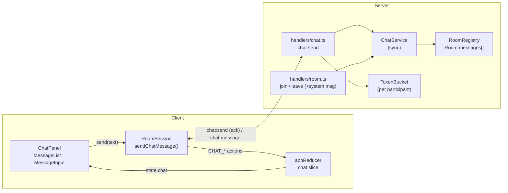
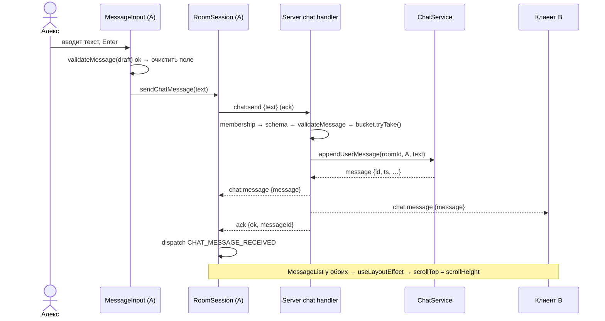
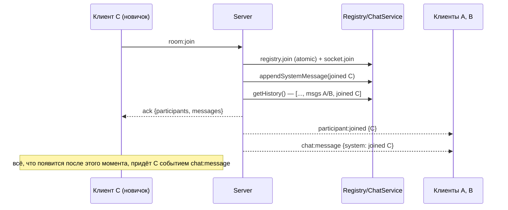
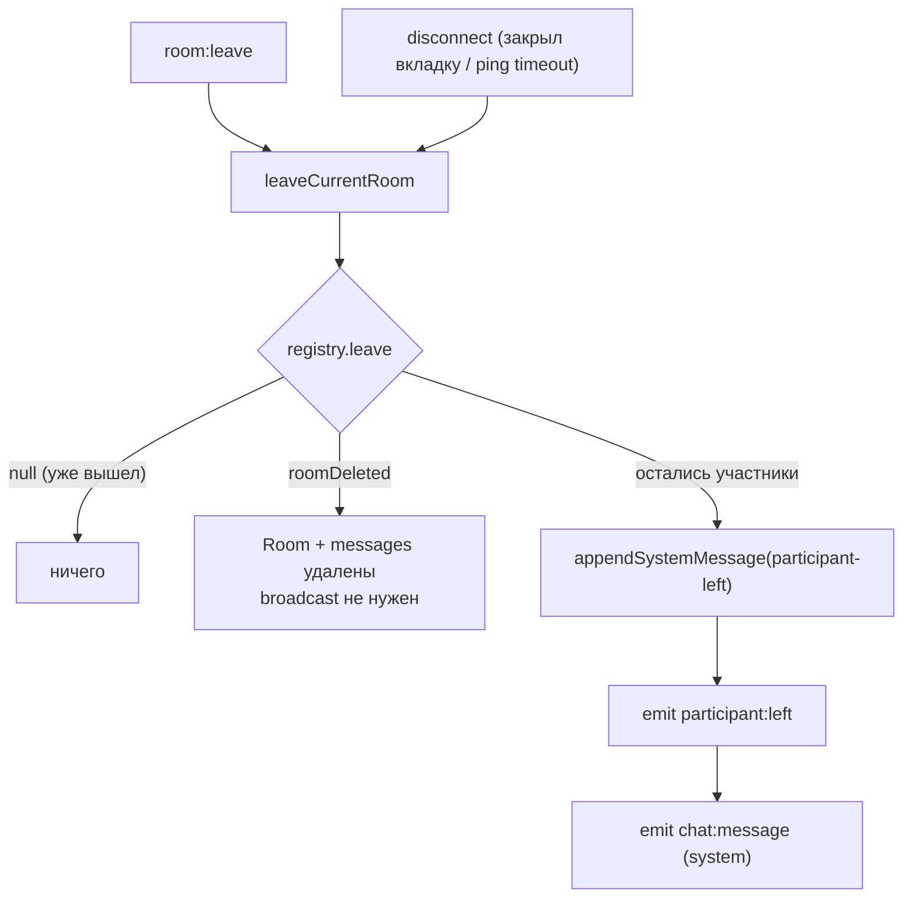

# TDD — Текстовый чат и системные сообщения

| | |
|---|---|
| **Документ** | Technical Design Document (TDD) |
| **feature-name** | `chat-system-messages` |
| **Этап** | 2 из 5 |
| **Версия** | 1.0 (Draft) |
| **Дата** | 2026-09-13 |
| **PRD** | [`prd-video-chat-room.md`](../../prd-video-chat-room.md) v1.0 |
| **Зависит от** | [1 — room-skeleton](../room-skeleton/design-room-skeleton.md): общая архитектура, контракт, `RoomRegistry`, `RoomSession`, reducer |
| **Следующий этап** | [3 — local-media-controls](../local-media-controls/design-local-media-controls.md) |

> Документ описывает **только дельту** к этапу 1. Общие решения (стек, структура репозитория, режимы запуска, CI, CSP) заданы в TDD этапа 1 и здесь не повторяются.

---

## 1. Overview / Контекст

### 1.1 Цель этапа

Добавить в комнату общий текстовый чат:

- отправка и получение сообщений в реальном времени, имя отправителя и время `HH:MM` по локальным часам клиента;
- история за время жизни комнаты: поздний участник видит, что писали до его входа, и история удаляется вместе с комнатой;
- системные сообщения «присоединился / покинул комнату», одинаковые для осознанного выхода и обрыва;
- защита от XSS, пустых сообщений и флуда;
- автопрокрутка к новому сообщению.

### 1.2 Покрываемые требования PRD

| Группа | Требования |
|---|---|
| Текстовый чат | FR 21 (F-12), 22 (F-13), 23 (F-14), 24, 25 (F-15) |
| Сессия | FR 27, 31: системное сообщение о выходе |
| Валидация и безопасность | FR 39 (текст сообщений), FR 40 (лимит длины и антифлуд) |
| User Stories | US-8 полностью, US-9 (системные события), US-10/US-11 (сообщение о выходе) |

**Не входит:** ссылки-гиперссылки (linkify), файлы, редактирование и удаление, личные сообщения, реакции, звуки (PRD, Non-Goals).

### 1.3 Ограничения

- История хранится **только в памяти** внутри объекта `Room` и живёт ровно столько, сколько комната (FR-9, FR-23).
- На клиенте история не сохраняется: перезагрузка равна новому входу, и история приходит заново с сервера, пока комната жива.
- Интерфейс только на русском.

---

## 2. Current Architecture & Codebase Summary

Состояние **после этапа 1** (файлы, спроектированные в [design-room-skeleton.md](../room-skeleton/design-room-skeleton.md)). Кода в репозитории на момент написания нет.

| Путь | Класс / функция | Назначение | Что меняется на этапе 2 |
|---|---|---|---|
| `packages/shared/src/protocol.ts` | `ClientToServerEvents`, `ServerToClientEvents`, `JoinAck`, `ServerErrorCode` | Типизированный сокет-контракт | + `ChatMessage`, `chat:send`, `chat:message`, `messages` в `JoinAck`, коды `INVALID_MESSAGE`, `RATE_LIMITED` |
| `packages/shared/src/constants.ts` | `MAX_PARTICIPANTS`, `NAME_MAX_LENGTH`, … | Общие константы | + `MESSAGE_MAX_LENGTH`, `CHAT_HISTORY_LIMIT`, `CHAT_RATE_LIMIT` |
| `packages/shared/src/validation.ts` | `normalizeName`, `validateName` | Валидация имени | + `normalizeMessage`, `validateMessage` |
| `packages/server/src/rooms/types.ts` | `Room`, `Participant` | In-memory модель | + `Room.messages`, `Participant.chatBucket` |
| `packages/server/src/rooms/RoomRegistry.ts` | `RoomRegistry.join/leave/…` | Атомарный реестр комнат | Без изменений в логике. Удаление комнаты автоматически удаляет историю |
| `packages/server/src/socket/handlers/room.ts` | `registerRoomHandlers` | `room:join`, `room:leave`, `disconnect` | Join: + системное сообщение, + `messages` в ack, + broadcast `chat:message` |
| `packages/server/src/socket/leaveCurrentRoom.ts` | `leaveCurrentRoom` | Идемпотентный выход | + системное сообщение о выходе |
| `packages/client/src/state/appReducer.ts` | `appReducer`, `AppState`, `AppAction` | Состояние клиента | + срез `chat` |
| `packages/client/src/session/RoomSession.ts` | `RoomSession` | Side effects, сокет | + `sendChatMessage()`, подписка на `chat:message` |
| `packages/client/src/features/room/RoomPage.tsx` | `RoomPage` | Экран комнаты | + боковая панель с чатом |

---

## 3. Proposed Architecture / High-Level Design



Ключевые решения:

| Решение | Альтернатива | Почему так |
|---|---|---|
| **Системные сообщения генерирует сервер** и хранит их в той же ленте, что и пользовательские | Клиент рисует их из `participant:joined/left` | Позднему участнику нужна единая упорядоченная история (FR-23). Клиент не может восстановить события, которые произошли до его входа |
| **Отправитель получает своё сообщение тем же broadcast'ом**, что и остальные (`io.to(room)`) | Оптимистичный рендер на клиенте + `socket.to(room)` | Один путь рендера, одинаковый порядок у всех, нет дедупликации pending/confirmed. В LAN задержка незаметна |
| **`ts` проставляет сервер** (epoch ms), форматирует клиент в локальной TZ | Время клиента-отправителя | Порядок и время согласованы у всех. Требование «по локальному времени клиента» соблюдено, потому что форматирование локальное |
| **Ограниченная история** (`CHAT_HISTORY_LIMIT = 200`) | Без лимита | Защита памяти процесса. 200 сообщений покрывают сценарий «созвон вчетвером» |
| **Имя автора копируется в сообщение** (`authorName`) | Lookup по `authorId` | Автор мог уже выйти, а сообщение должно остаться подписанным |

---

## 4. Components & Interfaces

### 4.1 `@vcr/shared`

#### `constants.ts` (+)

```ts
export const MESSAGE_MAX_LENGTH = 1000;                     // code points после нормализации
export const CHAT_HISTORY_LIMIT = 200;
export const CHAT_RATE_LIMIT = { burst: 5, refillPerSecond: 1 } as const;
```

#### `validation.ts` (+)

```ts
/** CRLF/CR → LF; удалить управляющие символы C0/C1, кроме \n и \t;
 *  удалить bidi-override (U+202A–U+202E, U+2066–U+2069); NFC; trim. */
export function normalizeMessage(raw: string): string;

export type MessageValidation =
  | { ok: true; value: string }
  | { ok: false; reason: 'EMPTY' | 'TOO_LONG' };

export function validateMessage(raw: string): MessageValidation;
```

> Bidi-override символы удаляются намеренно: без этого сообщение вида `‮txt.exe` визуально переворачивается и может выдавать себя за другой текст. Это не XSS, но это спуфинг.

#### `protocol.ts` (+)

```ts
export type SystemEvent = 'participant-joined' | 'participant-left';

export type ChatMessage =
  | {
      kind: 'user';
      id: string;          // UUID
      ts: number;          // epoch ms, серверные часы
      authorId: string;
      authorName: string;  // снимок имени на момент отправки
      text: string;        // нормализованный, НЕ HTML-экранированный
    }
  | {
      kind: 'system';
      id: string;
      ts: number;
      event: SystemEvent;
      participantId: string;
      participantName: string;
    };

export type ServerErrorCode =
  | /* этап 1 */ 'INVALID_PAYLOAD' | 'INVALID_NAME' | 'INVALID_ROOM_ID'
  | 'ALREADY_JOINED' | 'ROOM_FULL' | 'NOT_IN_ROOM' | 'INTERNAL'
  | /* этап 2 */ 'INVALID_MESSAGE' | 'RATE_LIMITED';

export type JoinAck = Ack<{
  self: ParticipantDTO;
  participants: ParticipantDTO[];
  messages: ChatMessage[];            // + этап 2: история, старые → новые
}>;

export interface ClientToServerEvents {
  // … этап 1
  'chat:send': (req: { text: string }, ack: (res: Ack<{ messageId: string }>) => void) => void;
}

export interface ServerToClientEvents {
  // … этап 1
  'chat:message': (e: { message: ChatMessage }) => void;
}
```

> Текст хранится и передаётся **как есть** (после нормализации), без HTML-экранирования на сервере. Экранирование — ответственность слоя отображения: React выводит строку текстовым узлом. Двойное экранирование (`&amp;lt;`) — частый баг при попытке «экранировать на всякий случай» на сервере.

### 4.2 Сервер

#### `rooms/types.ts` (+)

```ts
export interface Room {
  // … этап 1
  messages: ChatMessage[];       // ≤ CHAT_HISTORY_LIMIT, порядок = порядок добавления
}

export interface Participant {
  // … этап 1
  chatBucket: TokenBucket;
}
```

#### `chat/TokenBucket.ts`

```ts
export class TokenBucket {
  constructor(opts: { capacity: number; refillPerSecond: number; now?: () => number });
  /** Синхронно: пополнить по прошедшему времени, списать 1 токен при наличии. */
  tryTake(): boolean;
}
```

#### `chat/ChatService.ts`

```ts
export class ChatService {
  constructor(deps: {
    registry: RoomRegistry;
    historyLimit?: number;             // default CHAT_HISTORY_LIMIT
    now?: () => number;
    newId?: () => string;              // default crypto.randomUUID
  });

  appendUserMessage(roomId: string, author: Participant, text: string): ChatMessage;
  appendSystemMessage(roomId: string, event: SystemEvent, subject: Participant): ChatMessage;
  getHistory(roomId: string): ChatMessage[];   // копия массива
}
```

Все методы синхронные. При переполнении удаляется самое старое сообщение (`shift`). При 200 элементах O(n) не важен, кольцевой буфер не нужен.

#### `socket/handlers/chat.ts`

```ts
export function registerChatHandlers(ctx: HandlerContext, socket: AppSocket): void;
```

```ts
// эскиз
socket.on('chat:send', (raw, ack) => {
  if (typeof ack !== 'function') return;
  const member = getMembership(ctx, socket);            // { roomId, participant } | null
  if (!member) return ack(fail('NOT_IN_ROOM'));
  const parsed = ChatSendSchema.safeParse(raw);         // { text: z.string().max(8000) }.strict()
  if (!parsed.success) return ack(fail('INVALID_PAYLOAD'));
  const text = validateMessage(parsed.data.text);
  if (!text.ok) return ack(fail('INVALID_MESSAGE'));
  if (!member.participant.chatBucket.tryTake()) return ack(fail('RATE_LIMITED'));

  const message = ctx.chat.appendUserMessage(member.roomId, member.participant, text.value);
  ctx.io.to(adapterRoom(member.roomId)).emit('chat:message', { message });
  ack({ ok: true, messageId: message.id });
});
```

`HandlerContext` расширяется полем `chat: ChatService`.

#### Изменения в `handlers/room.ts` (join)

Порядок операций важен, чтобы не было ни дублей, ни дыр в истории:

```ts
// после атомарной секции этапа 1 (registry.join + socket.join)
const joinedMsg = ctx.chat.appendSystemMessage(roomId, 'participant-joined', participant);
ack({
  ok: true,
  self: toDTO(participant),
  participants: ctx.registry.listParticipants(roomId),
  messages: ctx.chat.getHistory(roomId),                  // включает joinedMsg
});
socket.to(adapterRoom(roomId)).emit('participant:joined', { participant: toDTO(participant) });
socket.to(adapterRoom(roomId)).emit('chat:message', { message: joinedMsg });
```

**Почему нет дыр и дублей.** Снимок истории и вход в adapter-room происходят в одном синхронном блоке. Всё, что добавлено в историю раньше, попадает в `messages`. Всё, что позже, приходит событием `chat:message`, потому что сокет уже в комнате. Своё системное сообщение новичок получает только в истории, так как broadcast идёт через `socket.to`, который исключает отправителя. Клиент всё равно дедуплицирует по `id` (§4.3) — это защита на случай будущих изменений.

#### Изменения в `leaveCurrentRoom.ts`

```ts
const res = ctx.registry.leave(roomId, participantId);
socket.leave(adapterRoom(roomId));
if (res && !res.roomDeleted) {
  const leftMsg = ctx.chat.appendSystemMessage(roomId, 'participant-left', res.participant);
  ctx.io.to(adapterRoom(roomId)).emit('participant:left', { participantId });
  ctx.io.to(adapterRoom(roomId)).emit('chat:message', { message: leftMsg });
}
// roomDeleted → история удалена вместе с Room, сообщение никому не нужно
```

Одно и то же сообщение `participant-left` генерируется и для `room:leave`, и для `disconnect` (FR-31: формулировку «соединение потеряно» не используем).

### 4.3 Клиент

#### `state/appReducer.ts` (+)

```ts
export interface ChatState {
  messages: ChatMessage[];          // ≤ CHAT_HISTORY_LIMIT
  messageIds: Set<string>;          // для дедупликации (или Record<string, true>)
}

export interface Notice { id: number; text: string; tone: 'info' | 'error' }

export interface AppState {
  // … этап 1
  chat: ChatState;
  notice: Notice | null;            // общий слот тостов; переиспользуют этапы 3–4
}

export type AppAction =
  // … этап 1 (JOIN_SUCCEEDED получает поле messages)
  | { type: 'CHAT_MESSAGE_RECEIVED'; message: ChatMessage }
  | { type: 'CHAT_SEND_FAILED'; code: 'INVALID_MESSAGE' | 'RATE_LIMITED' | 'NOT_IN_ROOM' | 'TIMEOUT' }
  | { type: 'NOTICE_DISMISSED' };
```

Правила:
- `JOIN_SUCCEEDED` заменяет `chat.messages` историей из ack.
- `CHAT_MESSAGE_RECEIVED` игнорируется вне фазы `joined` и для уже известного `id`. При превышении лимита отбрасывает старые.
- `LEFT_ROOM`, `JOIN_FAILED`, `CONNECTION_LOST` очищают чат.
- `CHAT_SEND_FAILED` пишет в `state.notice` (общий слот тостов) текст по коду.

> Если `Set` в state мешает сериализации и devtools, используйте `Record<string, true>`. Производительность при 200 элементах не отличается.

#### `session/RoomSession.ts` (+)

```ts
/** Возвращает Promise<boolean> только для UX поля ввода (восстановить текст при ошибке).
 *  Сама доставка сообщения в state идёт через broadcast chat:message. */
sendChatMessage(text: string): Promise<boolean>;
```

Внутри используется callback-ack с `socket.timeout(ACK_TIMEOUT_MS)`, как на этапе 1. Слушатель `chat:message` навешивается вместе с остальными **до** `connect()`.

#### Компоненты

| Компонент | Ответственность |
|---|---|
| `features/chat/ChatPanel.tsx` | Контейнер: `MessageList` + `MessageInput`, берёт `state.chat`, `selfId`, `session` |
| `features/chat/MessageList.tsx` | `<ol role="log" aria-live="polite">`. Рендер `UserMessageItem` / `SystemMessageItem`, ключ `message.id`. Автопрокрутка через `useStickToBottom` |
| `features/chat/UserMessageItem.tsx` | Имя автора, время `formatTime(ts)`, текст `{message.text}` (текстовый узел). Для `authorId === selfId` — модификатор `--own` |
| `features/chat/SystemMessageItem.tsx` | Текст из `formatSystemMessage(message, selfId)`, приглушённый стиль, время |
| `features/chat/MessageInput.tsx` | `<textarea>`: Enter отправляет, Shift+Enter переносит строку, во время IME-композиции (`nativeEvent.isComposing`) Enter не отправляет. Кнопка неактивна, пока `validateMessage(draft)` не `ok`. Счётчик появляется от 900 символов. Черновик в локальном `useState` |
| `features/chat/formatTime.ts` | `new Intl.DateTimeFormat('ru-RU', { hour: '2-digit', minute: '2-digit', hour12: false })`, форматтер создаётся один раз на модуль |
| `features/chat/formatSystemMessage.ts` | Тексты системных событий (§4.3.1) |
| `features/chat/useStickToBottom.ts` | `useLayoutEffect` на `messages.length` → `el.scrollTop = el.scrollHeight` |

Отправка в `MessageInput`: при submit текст берётся из черновика, поле очищается сразу, вызывается `session.sendChatMessage(text)`. Если результат `false` и поле всё ещё пустое, текст возвращается в поле. Тост показывает reducer.

##### 4.3.1 Тексты системных сообщений

| Событие | Для себя | Для других |
|---|---|---|
| `participant-joined` | «Вы присоединились к комнате» | «Алекс присоединился(-ась) к комнате» |
| `participant-left` | — (свой выход не видим) | «Алекс покинул(а) комнату» |

Имя подставляется **конкатенацией строк в JSX** (`{name} присоединился…`), без шаблонизации через HTML.

##### 4.3.2 Раскладка `RoomPage`

```text
┌──────────────────────────── RoomHeader ─────────────────────────────┐
├───────────────────────────────────────────┬─────────────────────────┤
│                                           │ ParticipantList         │
│   область видео                           ├─────────────────────────┤
│   (этап 2: заглушка; этапы 3–5: сетка)    │ ChatPanel               │
│                                           │  MessageList (flex: 1)  │
│                                           │  MessageInput           │
└───────────────────────────────────────────┴─────────────────────────┘
```

CSS Grid `grid-template-columns: 1fr 340px`, минимальная ширина 1024px (PRD §6). У `MessageList` задано `overflow-y: auto; min-height: 0`, без этого flex-потомок не скроллится. У текста — `white-space: pre-wrap; overflow-wrap: anywhere`, чтобы длинная ссылка без пробелов не ломала вёрстку.

---

## 5. Data Model & DB Changes

БД нет. Расширение in-memory модели:

```ts
Room {
  id, createdAt, participants,         // этап 1
  messages: ChatMessage[]              // + этап 2
}
Participant {
  id, socketId, name, joinedAt,        // этап 1
  chatBucket: TokenBucket              // + этап 2
}
```

| Свойство | Значение |
|---|---|
| Порядок сообщений | Порядок `push` в `Room.messages` = порядок обработки на сервере. Совпадает у всех клиентов |
| Удаление | Вместе с `Room` при уходе последнего участника (FR-9). Отдельной очистки нет |
| Лимит | 200 сообщений на комнату; при переполнении удаляется самое старое |
| Память | ≤ 200 × (~1 KB текст + метаданные) ≈ 250 KB на комнату в худшем случае |
| Миграции | Не нужны (нет персистентности) |

---

## 6. API / Contracts

### 6.1 `chat:send` (C→S, ack)

```json
// request
{ "text": "Ссылка на доку: https://example.com/spec" }

// ack — успех
{ "ok": true, "messageId": "5c1e…a7" }

// ack — ошибки
{ "ok": false, "error": { "code": "INVALID_MESSAGE" } }
{ "ok": false, "error": { "code": "RATE_LIMITED" } }
{ "ok": false, "error": { "code": "NOT_IN_ROOM" } }
```

### 6.2 `chat:message` (S→C, всем в комнате, включая отправителя)

```json
{
  "message": {
    "kind": "user",
    "id": "5c1e…a7",
    "ts": 1789300123456,
    "authorId": "8b0f…c1",
    "authorName": "Алекс",
    "text": "Ссылка на доку: https://example.com/spec"
  }
}
```

```json
{
  "message": {
    "kind": "system",
    "id": "e9d2…04",
    "ts": 1789300200000,
    "event": "participant-left",
    "participantId": "1d2e…9a",
    "participantName": "Мария"
  }
}
```

### 6.3 `room:join` ack (расширение)

```json
{
  "ok": true,
  "self": { "id": "8b0f…c1", "name": "Алекс", "joinedAt": 1789300000000 },
  "participants": [ /* … */ ],
  "messages": [
    { "kind": "system", "id": "…", "ts": 1789299990000, "event": "participant-joined",
      "participantId": "1d2e…9a", "participantName": "Мария" },
    { "kind": "user", "id": "…", "ts": 1789299995000, "authorId": "1d2e…9a",
      "authorName": "Мария", "text": "Привет! Жду остальных" },
    { "kind": "system", "id": "…", "ts": 1789300000000, "event": "participant-joined",
      "participantId": "8b0f…c1", "participantName": "Алекс" }
  ]
}
```

### 6.4 Коды ошибок (+)

| Код | Условие | UI |
|---|---|---|
| `INVALID_MESSAGE` | После нормализации пусто или > 1000 code points | Тост «Сообщение пустое или слишком длинное». Текст возвращается в поле |
| `RATE_LIMITED` | Бакет пуст (> 5 сообщений подряд быстрее 1/с) | Тост «Слишком часто. Подождите секунду». Текст возвращается в поле |
| `NOT_IN_ROOM` | Сокет не в комнате (гонка с выходом) | Молча игнорировать: фаза уже сменится через `disconnect` |
| клиентский `TIMEOUT` | Ack не пришёл за 5 с | Тост «Не удалось отправить сообщение» |

---

## 7. Data & Control Flows

### 7.1 Отправка сообщения (US-8)



### 7.2 Поздний вход (FR-23)



### 7.3 Выход и обрыв (FR-27, FR-31)



---

## 8. Error Handling & Edge Cases

| Ситуация | Поведение |
|---|---|
| Пустое или пробельное сообщение | Кнопка неактивна, Enter ничего не делает. Сервер отвечает `INVALID_MESSAGE` (защита от обхода UI) |
| Сообщение из одних управляющих или bidi-символов | После `normalizeMessage` пусто → `EMPTY` |
| `` | Хранится и выводится как текст. Скрипт не исполняется: React экранирует, `dangerouslySetInnerHTML` запрещён линтером |
| Сообщение > 1000 символов (вставка) | Клиент показывает счётчик, кнопка неактивна. Сервер отвечает `INVALID_MESSAGE` |
| Эмодзи и суррогатные пары | Длина считается по code points (`[...str].length`) одинаково на клиенте и сервере |
| Флуд (скрипт шлёт 100 сообщений/с) | С 6-го сообщения `RATE_LIMITED`. В историю и broadcast попадает не больше ~1/с |
| Отправка в момент выхода | Сервер отвечает `NOT_IN_ROOM`, клиент игнорирует |
| Ack не пришёл (сервер завис или связь пропала) | `TIMEOUT` → тост. Если сообщение всё же дошло, оно придёт broadcast'ом, дублей нет (дедуп по `id`) |
| Автор вышел | Его сообщения остаются подписаны `authorName` |
| Два «Алекса» пишут | Имена совпадают. Своё сообщение отличается модификатором `--own` по `authorId` |
| Смена часового пояса или часов клиента | Отображение `HH:MM` локальное, порядок задаёт сервер — порядок не ломается |
| Последний участник вышел, кто-то вошёл тем же URL | Новая `Room` с пустой историей (FR-9). В ленте только «Вы присоединились к комнате» |
| История переполнена | Новичок получает последние 200. У текущих участников reducer тоже обрезает до 200 |
| IME (китайский, японский ввод) | Enter во время композиции не отправляет сообщение |

---

## 9. Performance & Scalability

| Метрика | Цель | Обеспечение |
|---|---|---|
| Доставка сообщения в LAN | < 150 мс p95 | Один round-trip, прямой broadcast |
| Размер ack при входе | ≤ ~250 KB (худший случай) | `CHAT_HISTORY_LIMIT = 200`, `MESSAGE_MAX_LENGTH = 1000`. Укладывается в `maxHttpBufferSize` (он ограничивает входящие, а не исходящие пакеты) |
| Рендер ленты | Без заметных лагов на 200 элементах | Виртуализация не нужна. Элементы — `memo`-компоненты, ключи по `id` |
| Нагрузка флудом | ≤ 1 сообщение/с на участника в установившемся режиме | `TokenBucket` |

---

## 10. Security & Compliance

| Угроза | Мера |
|---|---|
| Stored XSS через текст или имя | React-текстовые узлы, `react/no-danger: error`, linkify нет. Сервер хранит сырой нормализованный текст и **не** экранирует его в HTML (иначе будет двойное экранирование) |
| Спуфинг через bidi-override и невидимые символы | `normalizeMessage` удаляет U+202A–U+202E, U+2066–U+2069 и управляющие C0/C1, кроме `\n`, `\t` |
| Флуд и DoS памяти | `TokenBucket` на участника, лимит длины, лимит истории |
| Подделка автора | `authorId` и `authorName` берутся из серверного `Participant` сокета, а не из payload |
| Чтение чужой комнаты | Broadcast только в `room:${roomId}`, `chat:send` принимается только от участника комнаты |
| PII / приватность | Тексты **не логируются** (в логах только `roomId`, `messageId`, длина). История только в памяти, удаляется с комнатой. На клиенте не сохраняется |
| CSP | Без изменений относительно этапа 1 (нет внешних ресурсов, нет inline-скриптов) |

---

## 11. Testing Strategy

### 11.1 Unit

| Модуль | Кейсы |
|---|---|
| `shared/validation` — `normalizeMessage`/`validateMessage` | `""`, `"   "`, `"\n\t"`, CRLF → LF, `"‮abc"` → `"abc"`, 1000 и 1001 code points, эмодзи-строка на границе |
| `server/TokenBucket` | Фейковые часы: 5 подряд `true`, 6-й `false`, через 1 с снова `true`, не накапливает больше `capacity` |
| `server/ChatService` | Порядок, `historyLimit` (201-е вытесняет 1-е), `getHistory` возвращает копию, поля `authorName` и `participantName` — снимки |
| `client/appReducer` (chat) | История из `JOIN_SUCCEEDED`, дедуп, обрезка до 200, игнор вне `joined`, очистка при `LEFT_ROOM` |
| `client/formatTime` | `TZ=Europe/Moscow` в setup: `ts` → `"09:05"` (ведущий ноль, 24-часовой формат) |
| `client/formatSystemMessage` | Свой и чужой вход, выход |

### 11.2 Component (jsdom)

| Компонент | Кейсы |
|---|---|
| `MessageList` | `` рендерится текстом (`getByText`, в DOM нет `img`). Автопрокрутка: подменить `scrollHeight`, проверить присваивание `scrollTop` после нового сообщения |
| `MessageInput` | Enter отправляет, Shift+Enter нет; при `isComposing` нет; кнопка неактивна при пустом вводе; текст возвращается при `false` |

### 11.3 Integration (реальный сервер + socket.io-client)

| Тест | Ожидание |
|---|---|
| 3 клиента, A отправляет | A, B, C получают одинаковый `chat:message`; A получает ack `ok` |
| Поздний вход | A и B переписываются, C входит → `messages` содержит их сообщения и системные события в правильном порядке; нет дубля своего `joined` |
| Выход и обрыв | B `disconnect()` → A получает `participant:left` и `chat:message{system, participant-left}` |
| Жизненный цикл | Все вышли, A входит снова → `messages` = только собственное `joined` |
| Валидация | Пустой, 1001 символ, `{ text: 1 }`, лишнее поле → коды |
| Не в комнате | `chat:send` до `room:join` → `NOT_IN_ROOM` |
| Rate limit | 10 `chat:send` синхронно → 5 `ok`, 5 `RATE_LIMITED` |
| Подделка автора | Payload `{ text, authorName: "Админ" }` → `INVALID_PAYLOAD` (strict) |
| Лимит истории | 205 сообщений (с отключённым rate limit через опцию сервера для теста) → новичок получает 200 |

### 11.4 E2E (Playwright, `e2e/tests/chat.spec.ts`)

1. A и B в комнате: A пишет → у B сообщение с именем «A» и временем по регулярке `/^\d{2}:\d{2}$/`.
2. XSS: A отправляет `` → у B `await page.evaluate(() => window.__xss)` равен `undefined`, текст виден как есть; `page.on('dialog')` не срабатывает.
3. Поздний вход: C входит после переписки и видит историю.
4. Системные сообщения: C закрывает вкладку → у A появляется «C покинул(а) комнату».
5. Автопрокрутка: 30 сообщений (с паузами, чтобы не упереться в rate limit) → последнее `toBeInViewport()`.
6. Пустое сообщение: кнопка отправки `toBeDisabled()`.

### 11.5 Покрытие

`ChatService`, `TokenBucket`, `validation` ≥ 95%; chat-срез reducer ≥ 90%; компоненты чата ≥ 80%.

---

## 12. Deployment & Migration Plan

- Контракт расширяется аддитивно (новые события, новое поле `messages` в ack). Клиент и сервер деплоятся **вместе** из одного монорепо, так что проблем совместимости версий нет.
- Миграций нет: история только в памяти. Рестарт сервера очищает все комнаты.
- Feature flag не нужен. Если чат нужно быстро выключить, откатывается PR этапа (`git revert`).
- CI без изменений: новые тесты подхватываются Vitest projects и Playwright.
- Чек-лист мёржа: зелёные unit, integration и E2E; ручная проверка в двух браузерах (Chrome + Firefox) по LAN.

---

## 13. Risks & Mitigations

| Риск | Митигация |
|---|---|
| Двойное экранирование (`&lt;` в ленте), если кто-то добавит `escapeHtml` на сервере | Правило контракта: `text` передаётся сырым (§4.1), тест «`<b>` отображается как `<b>`» |
| Дыра или дубль в истории при входе при изменении порядка операций в join | Порядок зафиксирован (§4.2), integration-тест «поздний вход», клиентский дедуп по `id` |
| Rate limit мешает нормальной переписке (быстрые короткие реплики) | `burst 5` покрывает всплески. Значения — константы в shared, их легко подстроить |
| Автопрокрутка «отбирает» ленту у пользователя, читающего историю | PRD требует безусловной прокрутки, делаем её. Альтернатива — в §14 |
| Рост ack при входе на медленной сети | Лимит 200 × 1000 символов. Для LAN несущественно |
| Гендерные формы в системных сообщениях («присоединился(-ась)») выглядят громоздко | Вынесены в `formatSystemMessage`, копирайт уточняется (§14) |

---

## 14. Open Questions / TBD

1. **TBD:** Формулировки системных сообщений. Предложено «Алекс присоединился(-ась) к комнате» и «Алекс покинул(а) комнату». Альтернатива без родов: «В комнату вошёл участник: Алекс».
2. **TBD:** Нужен ли **linkify** (кликабельные `http(s)://` ссылки)? PRD упоминает «делиться ссылками», но расширенный чат вне скоупа. Если нужен, то только схемы `http:`/`https:`, `rel="noopener noreferrer" target="_blank"`, парсинг без `innerHTML`.
3. **TBD:** «Умная» автопрокрутка (не прокручивать, если пользователь отлистал вверх, и показать «↓ Новые сообщения»)? PRD требует безусловной. Предлагаю оставить как Should на будущее.
4. **TBD:** Значения по умолчанию: `MESSAGE_MAX_LENGTH = 1000`, `CHAT_HISTORY_LIMIT = 200`, rate limit `5 burst / 1 в секунду`. Подтвердить.
5. **Решено по умолчанию:** своё сообщение появляется после broadcast от сервера, без оптимистичного рендера.
