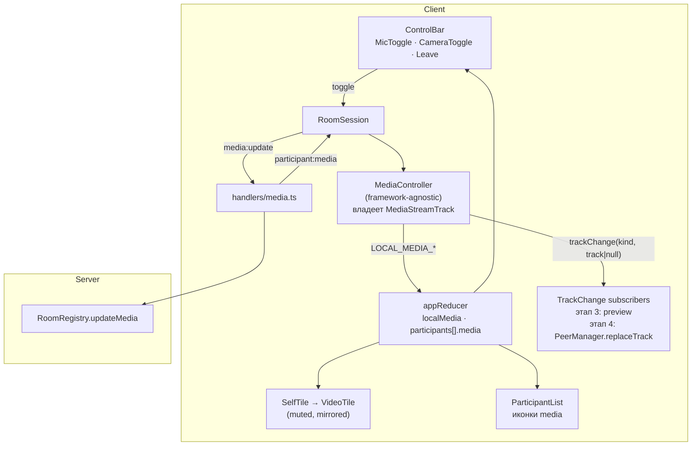
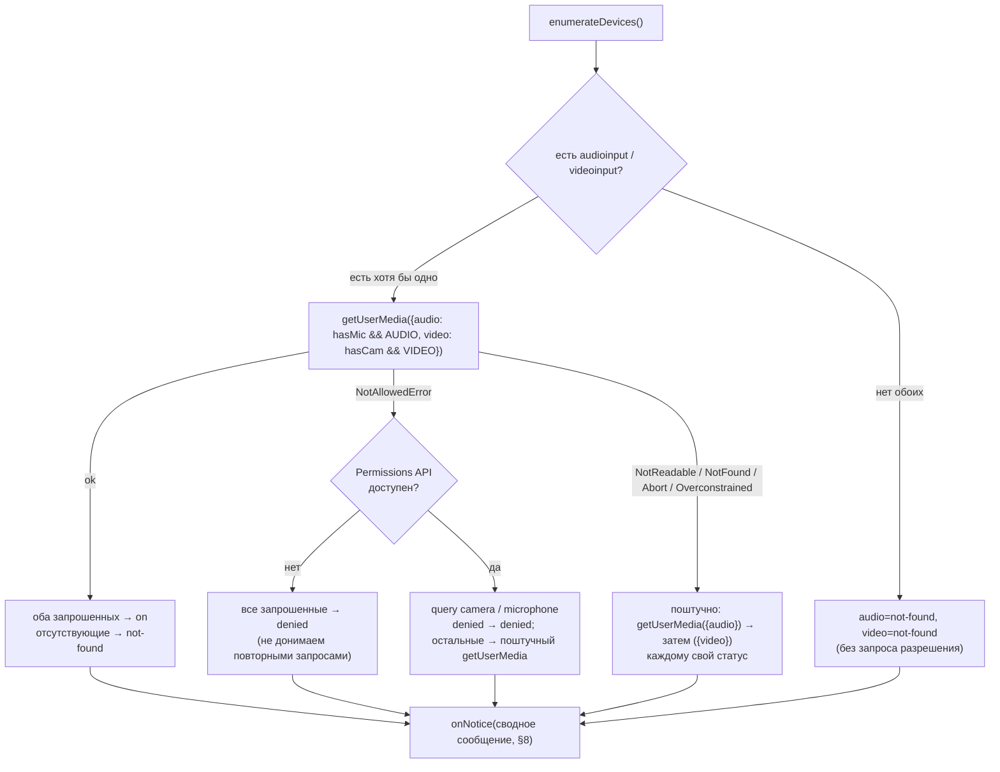
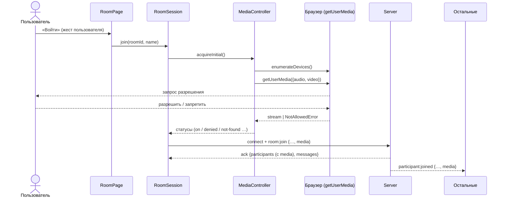
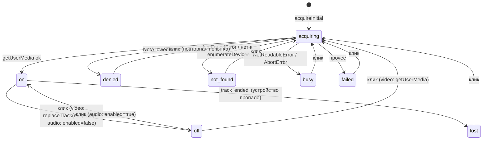

# TDD — Локальное медиа: self-view, тумблеры микрофона и камеры

| | |
|---|---|
| **Документ** | Technical Design Document (TDD) |
| **feature-name** | `local-media-controls` |
| **Этап** | 3 из 5 |
| **Версия** | 1.0 (Draft) |
| **Дата** | 2026-09-13 |
| **PRD** | [`prd-video-chat-room.md`](../../prd-video-chat-room.md) v1.0 |
| **Зависит от** | [1 — room-skeleton](../room-skeleton/design-room-skeleton-v2.md), [2 — chat-system-messages](../chat-system-messages/design-chat-system-messages-v2.md) (общий слот `notice`) |
| **Следующий этап** | [4 — webrtc-peer-call](../webrtc-peer-call/design-webrtc-peer-call.md) |

> Документ описывает **только дельту**. Общие решения заданы в TDD этапа 1.

---

## 1. Overview / Контекст

### 1.1 Цель этапа

Научить клиент работать с собственными камерой и микрофоном **до появления WebRTC** и заложить интерфейс, к которому на этапе 4 подключится передача медиа:

- захват медиа при входе, микрофон и камера по умолчанию включены (FR-13);
- корректный вход **без устройств**, **при отказе в доступе** и **при занятом устройстве**. Пользователь остаётся в комнате, а не «вылетает» (FR-14, FR-33);
- self-view и заглушка «силуэт + имя», когда видео нет (FR-18);
- тумблер микрофона (FR-15);
- тумблер камеры, который **физически освобождает камеру** — лампочка гаснет (FR-17, FR-19);
- обработка потери устройства во время звонка (FR-20);
- рассылка состояния mic/cam другим участникам. Иконки в списке участников видны уже на этом этапе, а на этапе 4 эти же данные управляют плитками.

### 1.2 Покрываемые требования PRD

| Группа | Требования |
|---|---|
| Видео и аудио | FR 13, 14 |
| Микрофон, камера и индикация | FR 15 (F-09), 16, 17 (F-10), 18, 19, 20 |
| Окружение | FR 33 |
| User Stories | US-6 (состояние по умолчанию, вход без устройств), US-7, US-12 |

**Не входит:** передача медиа другим участникам (этап 4), сетка из нескольких плиток (этап 5), выбор устройства в приложении (PRD, Non-Goals).

### 1.3 Ограничения и технические факты

- `getUserMedia` доступен только в secure context (гейт этапа 1).
- **`track.enabled = false` не гасит лампочку камеры.** Устройство освобождает только `track.stop()`, и остановленный трек нельзя «включить обратно»: для повторного включения нужен новый `getUserMedia`.
- Событие `ended` у трека **не срабатывает при вызове `track.stop()`**, только при внешней причине: устройство отключили или отозвали разрешение. Это позволяет отличать «выключил сам» от «устройство пропало».
- Все, кто использует трек, должны держать **один и тот же объект `MediaStreamTrack`**. Если self-view использует `track.clone()`, лампочка не погаснет, пока клон жив.

---

## 2. Current Architecture & Codebase Summary

Состояние **после этапов 1–2** (спроектированные файлы; кода в репозитории на момент написания нет).

| Путь | Класс / функция | Назначение | Изменение на этапе 3 |
|---|---|---|---|
| `packages/shared/src/protocol.ts` | `ParticipantDTO`, `JoinRequest`, события `room:*`, `participant:*`, `chat:*` | Контракт | + `MediaState`, `ParticipantDTO.media`, `JoinRequest.media`, `media:update`, `participant:media` |
| `packages/server/src/rooms/types.ts` | `Participant` | Модель | + `media: MediaState` |
| `packages/server/src/rooms/RoomRegistry.ts` | `RoomRegistry` | Реестр | + `updateMedia()` |
| `packages/server/src/socket/handlers/room.ts` | `room:join` | Вход | Принимает `media` в запросе |
| `packages/server/src/socket/` | `registerSocketHandlers` | Регистрация хендлеров | + `handlers/media.ts` |
| `packages/client/src/session/RoomSession.ts` | `RoomSession.join/leave/sendChatMessage` | Side effects | + владеет `MediaController`: захват до join, `stopAll` при выходе, `publishMediaState` |
| `packages/client/src/state/appReducer.ts` | `AppState` (`phase`, `participants*`, `chat`, `notice`) | Состояние | + `localMedia`, `PARTICIPANT_MEDIA_CHANGED` |
| `packages/client/src/features/room/RoomPage.tsx`, `RoomHeader.tsx` | Раскладка комнаты, «Выйти» в шапке | UI | + `VideoStage` с `SelfTile`; «Выйти» переезжает в `ControlBar` |
| `packages/client/src/features/room/ParticipantList.tsx` | Список имён | UI | + иконки mic-off / cam-off |

---

## 3. Proposed Architecture / High-Level Design



Ключевые решения:

| Решение | Почему |
|---|---|
| **`MediaController` — обычный класс вне React**, владеющий треками | Треки — изменяемые ресурсы с жизненным циклом. В reducer лежит только сериализуемый статус. Класс легко покрыть unit-тестами с фейковым `mediaDevices` |
| **Захват медиа до `room:join`**, в обработчике клика «Войти» или «Создать комнату» | (1) начальное `MediaState` уходит сразу в join, и остальные с первого кадра видят правильные иконки; (2) на этапе 4 к моменту первого offer локальные треки уже есть; (3) клик — жест пользователя для autoplay; (4) нет двойного захвата в StrictMode |
| **Микрофон: `track.enabled`**, камера: **`stop()` + новый `getUserMedia`** | PRD требует гасить только лампочку камеры. Выключение микрофона через `enabled` мгновенное, не вызывает повторных запросов разрешения и не требует `replaceTrack` |
| **Смена трека проходит через подписчиков `trackChange`**, controller ждёт их завершения | Контракт для этапа 4: сначала все отправители отцепляют трек (`replaceTrack(null)`), и только потом трек останавливается (§4.3) |
| **Состояние mic/cam рассылается через сокет**, а не выводится из медиапотока | Удалённая сторона не получает надёжного события «камеру выключили»: `replaceTrack(null)` не шлёт `ended`, а `mute` приходит с задержкой и по-разному в разных браузерах. Иконки и заглушки строятся по сигнальному состоянию |

---

## 4. Components & Interfaces

### 4.1 `@vcr/shared`

#### `protocol.ts` (+)

```ts
/** Публичное состояние: «передаётся ли». Причину (denied / not-found / …) знает только владелец. */
export interface MediaState {
  audio: boolean;
  video: boolean;
}

export interface ParticipantDTO {
  // … этап 1
  media: MediaState;
}

export interface JoinRequest {
  roomId: string;
  name: string;
  media: MediaState;               // + этап 3
}

export interface ClientToServerEvents {
  // … этапы 1–2
  'media:update': (state: MediaState) => void;          // fire-and-forget
}

export interface ServerToClientEvents {
  // … этапы 1–2
  'participant:media': (e: { participantId: string; media: MediaState }) => void;
}
```

#### `constants.ts` (+)

```ts
export const AUDIO_CONSTRAINTS: MediaTrackConstraints = {
  echoCancellation: true, noiseSuppression: true, autoGainControl: true,
};
export const VIDEO_CONSTRAINTS: MediaTrackConstraints = {
  width: { ideal: 640 }, height: { ideal: 360 }, frameRate: { ideal: 24, max: 30 },
};
```

> 640×360 при 24 fps выбрано с запасом под mesh на этапе 5: каждый клиент кодирует до 3 исходящих потоков. Разрешение уточняется в [TDD этапа 5](../mesh-group-call/design-mesh-group-call-v2.md).

### 4.2 Сервер

#### `rooms/RoomRegistry.ts` (+)

```ts
/** Синхронно. Возвращает false, если участника нет или состояние не изменилось. */
updateMedia(roomId: string, participantId: string, media: MediaState): boolean;
```

`join` сохраняет `input.media` в `Participant`.

#### `socket/schemas.ts` (+)

```ts
export const MediaStateSchema = z.object({ audio: z.boolean(), video: z.boolean() }).strict();
// JoinRequestSchema расширяется полем media: MediaStateSchema
```

#### `socket/handlers/media.ts`

```ts
socket.on('media:update', (raw) => {
  const member = getMembership(ctx, socket);
  if (!member) return;                                    // вне комнаты — молча
  const parsed = MediaStateSchema.safeParse(raw);
  if (!parsed.success) return;
  if (!ctx.registry.updateMedia(member.roomId, member.participant.id, parsed.data)) return;
  socket.to(adapterRoom(member.roomId))
        .emit('participant:media', { participantId: member.participant.id, media: parsed.data });
});
```

Ack не нужен: состояние идемпотентно, последнее значение побеждает, а Socket.io сохраняет порядок событий одного сокета.

### 4.3 Клиент — `media/MediaController.ts`

#### Типы

```ts
export type TrackKind = 'audio' | 'video';

export type DeviceStatus =
  | 'acquiring'   // идёт getUserMedia
  | 'on'          // трек есть и передаётся
  | 'off'         // выключено пользователем
  | 'denied'      // NotAllowedError / SecurityError
  | 'not-found'   // устройства нет (NotFoundError или нет в enumerateDevices)
  | 'busy'        // NotReadableError / AbortError — занято другим приложением или ОС
  | 'lost'        // трек завершился сам (ended): устройство отключили или отозвали доступ
  | 'failed';     // прочие ошибки

export interface LocalTracks {
  audio: MediaStreamTrack | null;
  video: MediaStreamTrack | null;
}

/** Подписчик может вернуть Promise — controller дождётся его перед stop(). */
export type TrackChangeListener = (kind: TrackKind, track: MediaStreamTrack | null) => void | Promise<void>;
```

#### Интерфейс

```ts
export class MediaController {
  constructor(deps: {
    mediaDevices: Pick<MediaDevices, 'getUserMedia' | 'enumerateDevices'>;
    permissions?: Pick<Permissions, 'query'>;             // navigator.permissions, если есть
    onStatus: (kind: TrackKind, status: DeviceStatus) => void;
    onNotice: (text: string, tone: 'info' | 'error') => void;
  });

  /** Стабильный MediaStream для self-view; содержит только текущий видеотрек. */
  readonly previewStream: MediaStream;

  getTracks(): LocalTracks;
  getPublicState(): MediaState;          // { audio: status==='on', video: status==='on' }

  acquireInitial(): Promise<void>;       // при входе
  setAudioEnabled(enabled: boolean): Promise<void>;
  setVideoEnabled(enabled: boolean): Promise<void>;

  onTrackChange(listener: TrackChangeListener): () => void;
  stopAll(): void;                       // при выходе / неудачном входе / CONNECTION_LOST
}
```

Все публичные асинхронные операции идут через **внутреннюю последовательную очередь** (`this.chain = this.chain.then(op)`). Быстрые двойные клики не порождают параллельных `getUserMedia` и «осиротевших» треков, которые держали бы камеру включённой.

#### Алгоритм `acquireInitial`



- `enumerateDevices()` до выдачи разрешения возвращает устройства с пустыми `label`, но **`kind` виден**. Этого достаточно, чтобы понять, что камеры нет вовсе, и не показывать запрос разрешения зря.
- При `OverconstrainedError` поштучный повтор идёт с `video: true` без ограничений.
- `permissions.query({ name: 'camera' | 'microphone' })` оборачивается в `try/catch`: в части браузеров эти имена не поддерживаются и бросают `TypeError`. В таком случае используется ветка «нет».

Классификация ошибок:

| `error.name` | `DeviceStatus` |
|---|---|
| `NotAllowedError`, `SecurityError` | `denied` |
| `NotFoundError`, `DevicesNotFoundError` | `not-found` |
| `NotReadableError`, `TrackStartError`, `AbortError` | `busy` |
| `OverconstrainedError` | повтор без ограничений, затем по результату |
| прочее | `failed` |

#### Камера: выключение (FR-19)

```ts
// эскиз последовательности
async disableVideo() {
  const track = this.tracks.video;
  if (!track) return this.setStatus('video', 'off');
  this.tracks.video = null;
  track.removeEventListener('ended', this.onVideoEnded);
  await this.emitTrackChange('video', null);   // 1) этап 4: sender.replaceTrack(null) у всех пиров
  this.previewStream.removeTrack(track);
  track.stop();                                 // 2) лампочка гаснет
  this.setStatus('video', 'off');               // 3) → reducer → media:update
}
```

**Почему именно в таком порядке, и зачем `replaceTrack`.** Вызов `track.stop()` на треке, прикреплённом к `RTCRtpSender`, **не рвёт** `RTCPeerConnection`: отправитель просто перестаёт слать кадры. Проблема возникает при **повторном включении**. Остановленный трек мёртв, новый трек нужно поставить в отправитель. Через `removeTrack` / `addTrack` это меняет SDP, вызывает `negotiationneeded` и требует новой пары offer/answer. Это ренеготиация, а с ней возвращается риск glare, от которого этап 4 избавляется правилом «offer шлёт только старожил». `sender.replaceTrack(newTrack)` меняет источник **без ренеготиации**. Поэтому контракт такой: отцепить трек от всех отправителей (`replaceTrack(null)`), затем `stop()`. При включении — `getUserMedia` и `replaceTrack(track)`.

> Предпосылка, которую обеспечивает этап 4: у каждого `RTCPeerConnection` **с самого начала есть видео-трансивер** в режиме `sendrecv`, даже если камеры нет или она выключена. Иначе `replaceTrack` некуда будет вставить трек.

#### Камера: включение

```ts
async enableVideo() {
  this.setStatus('video', 'acquiring');
  try {
    const stream = await this.md.getUserMedia({ video: VIDEO_CONSTRAINTS });
    const track = stream.getVideoTracks()[0];
    track.addEventListener('ended', this.onVideoEnded);
    this.tracks.video = track;
    this.previewStream.addTrack(track);
    await this.emitTrackChange('video', track);  // этап 4: sender.replaceTrack(track)
    this.setStatus('video', 'on');
  } catch (e) {
    this.setStatus('video', classify(e));
    this.onNotice(textFor('video', classify(e)), 'error');
  }
}
```

#### Микрофон

| Текущий статус | Действие при клике | Результат |
|---|---|---|
| `on` | `track.enabled = false` | `off` |
| `off` (трек жив) | `track.enabled = true` | `on` |
| `denied` / `not-found` / `busy` / `lost` / `failed` | `getUserMedia({ audio })` → `emitTrackChange('audio', track)` | `on` или новый статус ошибки + notice |

#### Потеря устройства (FR-20)

```ts
private onVideoEnded = (e: Event) => {
  if (e.target !== this.tracks.video) return;     // устаревший трек
  this.enqueue(async () => {
    this.tracks.video = null;
    await this.emitTrackChange('video', null);
    this.previewStream.removeTrack(e.target as MediaStreamTrack);
    this.setStatus('video', 'lost');
    this.onNotice('Камера отключена или стала недоступна. Проверьте устройство и включите камеру снова.', 'error');
  });
};
// аналогично onAudioEnded → 'lost'
```

Восстановление: пользователь выбирает или подключает устройство в настройках браузера или ОС и жмёт тумблер. Выполняется ветка «статус ошибки → `getUserMedia`».

#### `emitTrackChange`

```ts
private async emitTrackChange(kind: TrackKind, track: MediaStreamTrack | null) {
  const results = await Promise.allSettled([...this.listeners].map(l => l(kind, track)));
  // rejected → console.warn; stop() всё равно выполняется: приоритет — освободить камеру
}
```

### 4.4 Клиент — `RoomSession` (изменения)

```ts
export class RoomSession {
  readonly media: MediaController;          // + этап 3

  /** Вход: захват медиа → connect → room:join { media: media.getPublicState() }. */
  join(roomId: string, name: string): void;

  /** Дедупликация по lastSentMedia; отправляет только в фазе joined. */
  publishMediaState(state: MediaState): void;

  toggleAudio(): void;                      // → media.setAudioEnabled(!on)
  toggleVideo(): void;                      // → media.setVideoEnabled(!on)
}
```

Последовательность `join`:
1. `dispatch(JOIN_REQUESTED)`: фаза `joining`, подэтап `acquiring-media`.
2. `await media.acquireInitial()`.
3. Если за это время пользователь ушёл со страницы (фаза не `joining`), выполняется `media.stopAll()` и выход.
4. connect → `room:join { roomId, name, media: media.getPublicState() }` (callback-ack, как на этапе 1). `lastSentMedia` = отправленное значение.
5. `JOIN_FAILED` → `media.stopAll()`. `LEFT_ROOM` и `CONNECTION_LOST` → `media.stopAll()`.

Публикация изменений: `MediaController.onStatus` → `dispatch(LOCAL_MEDIA_STATUS_CHANGED)` → `session.publishMediaState(media.getPublicState())`. Вызов идёт напрямую из колбэка, без `useEffect`. Если статус изменился во время `joining` (например, устройство пропало между `getUserMedia` и ack), `JOIN_SUCCEEDED` вызывает `publishMediaState`, и расхождение с `lastSentMedia` отправляется сразу.

### 4.5 Клиент — state

```ts
export interface LocalMediaState {
  audio: DeviceStatus;
  video: DeviceStatus;
  videoTrackVersion: number;     // ++ при каждой смене видеотрека → перепривязка srcObject
}

export interface AppState {
  // … этапы 1–2
  joinStep: 'acquiring-media' | 'connecting' | null;
  localMedia: LocalMediaState;
}

export type AppAction =
  // … этапы 1–2
  | { type: 'LOCAL_MEDIA_STATUS_CHANGED'; kind: TrackKind; status: DeviceStatus }
  | { type: 'LOCAL_VIDEO_TRACK_CHANGED' }
  | { type: 'PARTICIPANT_MEDIA_CHANGED'; participantId: string; media: MediaState };
```

`ParticipantDTO.media` для себя reducer не хранит отдельно: для `selfId` UI использует `localMedia`, это источник правды без задержки сети.

### 4.6 Клиент — UI

| Компонент | Ответственность |
|---|---|
| `features/call/VideoTile.tsx` | **Переиспользуемая** плитка (этап 4 использует её для удалённых). Props: `name`, `stream: MediaStream \| null`, `showVideo: boolean`, `audioMuted: boolean`, `mirrored`, `muted`, `statusLabel?`, `streamVersion`. Держит `<video>` **смонтированным всегда** (см. примечание) и прячет его через CSS, когда `showVideo=false`, показывая `AvatarPlaceholder` |
| `features/call/AvatarPlaceholder.tsx` | Inline-SVG силуэта + имя (текстовый узел) + опциональная подпись статуса |
| `features/call/SelfTile.tsx` | `VideoTile` c `stream=session.media.previewStream`, `muted`, `mirrored`, `showVideo = localMedia.video === 'on'`, `statusLabel` по §8, подпись «Вы» |
| `features/call/VideoStage.tsx` | Этап 3: только `SelfTile`. На этапах 4–5 здесь появится сетка |
| `features/controls/ControlBar.tsx` | `MicToggle`, `CameraToggle`, «Выйти» (переезжает из `RoomHeader`) |
| `features/controls/DeviceToggle.tsx` | Кнопка с `aria-pressed`, иконкой (включено / выключено / предупреждение), `title` с причиной. `disabled` при `acquiring` |
| `features/room/ParticipantList.tsx` | + иконки перечёркнутого микрофона и камеры по `media`. Для себя — по `localMedia` |
| `features/room/MediaAccessBanner.tsx` | Постоянный баннер при `denied`: инструкция, как разрешить доступ (FR-33) |

> **Почему `<video>` не размонтируется при выключенной камере.** На этапе 4 удалённая плитка воспроизводит **и видео, и звук** через один и тот же `<video>`. Если размонтировать элемент при `showVideo=false`, у собеседника с выключенной камерой пропадёт звук. Правило вводится уже здесь, чтобы `VideoTile` был готов к переиспользованию.

Привязка потока:

```ts
useEffect(() => {
  const el = videoRef.current;
  if (!el) return;
  el.srcObject = stream;               // перепривязка при смене streamVersion:
  void el.play().catch(() => {});      // часть браузеров не подхватывает addTrack
}, [stream, streamVersion]);           // на уже привязанном MediaStream
```

Зеркалирование self-view: `transform: scaleX(-1)` только на `<video>`, не на подписи.

---

## 5. Data Model & DB Changes

БД нет. Изменения in-memory модели:

```ts
Participant {
  id, socketId, name, joinedAt, chatBucket,  // этапы 1–2
  media: MediaState                          // + этап 3: { audio: boolean; video: boolean }
}
```

| Правило | Значение |
|---|---|
| Начальное значение | Из `JoinRequest.media` |
| Обновление | `media:update`, последнее значение побеждает |
| Удаление | Вместе с участником |
| Миграции | Не нужны |

Клиентский «ресурсный» слой (не state): `MediaController.tracks: LocalTracks`, `previewStream: MediaStream`.

---

## 6. API / Contracts

### 6.1 `room:join` (расширение)

```json
{ "roomId": "q7Z3kP0aX_2m", "name": "Алекс", "media": { "audio": true, "video": false } }
```

ack и `participant:joined` содержат `media` в каждом `ParticipantDTO`:

```json
{ "participant": { "id": "8b0f…c1", "name": "Алекс", "joinedAt": 1789300000000,
                   "media": { "audio": true, "video": false } } }
```

### 6.2 `media:update` (C→S, без ack)

```json
{ "audio": false, "video": true }
```

### 6.3 `participant:media` (S→C, всем, кроме отправителя)

```json
{ "participantId": "8b0f…c1", "media": { "audio": false, "video": true } }
```

### 6.4 Ошибки

Серверных кодов не добавляется. Невалидный `media:update` или событие вне комнаты сервер игнорирует. Отсутствие `media` в `room:join` отклоняется с `INVALID_PAYLOAD`: клиент и сервер деплоятся вместе.

---

## 7. Data & Control Flows

### 7.1 Вход с захватом медиа



### 7.2 Выключение и включение камеры

```mermaid
sequenceDiagram
  actor U as Пользователь
  participant MC as MediaController
  participant L as TrackChange listeners<br/>(этап 4: PeerManager)
  participant RS as RoomSession
  participant IO as Server
  participant O as Остальные

  U->>MC: setVideoEnabled(false)
  MC->>L: trackChange('video', null)
  L-->>MC: все sender.replaceTrack(null) завершены
  MC->>MC: previewStream.removeTrack; track.stop()  💡 лампочка гаснет
  MC->>RS: onStatus(video, off)
  RS->>IO: media:update {audio:true, video:false}
  IO-->>O: participant:media → заглушка «силуэт + имя»

  U->>MC: setVideoEnabled(true)
  MC->>MC: status acquiring
  MC->>MC: getUserMedia({video}) → новый track
  MC->>L: trackChange('video', track)
  L-->>MC: sender.replaceTrack(track) — без ренеготиации
  MC->>RS: onStatus(video, on)
  RS->>IO: media:update {video:true}
```

### 7.3 Автомат состояний устройства



---

## 8. Error Handling & Edge Cases

### 8.1 Тексты статусов (подпись на self-view и `title` кнопки)

| Статус | Камера | Микрофон |
|---|---|---|
| `acquiring` | «Включаем камеру…» | «Включаем микрофон…» |
| `off` | «Камера выключена» | «Микрофон выключен» |
| `denied` | «Нет доступа к камере» | «Нет доступа к микрофону» |
| `not-found` | «Камера не найдена» | «Микрофон не найден» |
| `busy` | «Камера занята другим приложением» | «Микрофон занят другим приложением» |
| `lost` | «Камера отключена» | «Микрофон отключён» |
| `failed` | «Не удалось включить камеру» | «Не удалось включить микрофон» |

### 8.2 Сценарии

| Ситуация | Поведение |
|---|---|
| Пользователь запретил доступ (FR-33, US-12) | Входит в комнату, статусы `denied`. Баннер: «Нет доступа к камере и микрофону. Разрешите доступ в настройках сайта (значок слева от адреса) и нажмите кнопку устройства» |
| Камеры нет физически, микрофон есть (FR-14) | Запрос только `{ audio }`; video `not-found`; тихий notice «Камера не найдена — вы в комнате без видео» |
| Нет ни одного устройства | Запроса разрешения нет, оба `not-found`, вход штатный |
| Камера занята (Windows, другое приложение) | Поштучный повтор: микрофон `on`, камера `busy` |
| Пользователь не отвечает на запрос разрешения | Фаза `joining/acquiring-media` с подсказкой «Разрешите доступ к камере и микрофону во всплывающем окне браузера» и кнопкой «Войти без камеры и микрофона» (прерывает ожидание: статусы `off`, при позднем ответе треки сразу останавливаются) |
| Выдернули USB-камеру | `ended` → `replaceTrack(null)` → `lost` → notice. Остальные видят заглушку |
| Отозвали разрешение в настройках во время звонка | Браузер завершает трек (`ended`) → `lost` |
| Двойной клик по тумблеру | Кнопка `disabled` при `acquiring`, плюс последовательная очередь в controller |
| Выход, пока идёт `getUserMedia` | `stopAll()` помечает controller как disposed; трек из завершившегося позже `getUserMedia` немедленно останавливается |
| Комната заполнена после захвата медиа | `JOIN_FAILED(ROOM_FULL)` → `stopAll()` (лампочка гаснет). «Повторить вход» захватывает заново |
| Слушатель `trackChange` бросил ошибку | `allSettled`: трек всё равно останавливается, ошибка идёт в `console.warn` |
| React StrictMode | Захват только в обработчиках событий, двойного `getUserMedia` нет |

---

## 9. Performance & Scalability

| Метрика | Цель | Обеспечение |
|---|---|---|
| Выключение камеры → лампочка гаснет | < 300 мс | `replaceTrack(null)` (микросекунды без пиров) → `stop()` |
| Включение камеры → self-view | < 1.5 с (зависит от драйвера) | Показ `acquiring`, отсутствие блокировки UI |
| Переключение микрофона | Мгновенно | `track.enabled` |
| Нагрузка захвата | 640×360@24 | `VIDEO_CONSTRAINTS` (ideal, браузер масштабирует) |
| Трафик сигналинга | Единицы байт на переключение | `media:update` только при реальном изменении (дедупликация на клиенте и сервере) |

---

## 10. Security & Compliance

| Аспект | Мера |
|---|---|
| Приватность камеры | Камера **физически** освобождается при выключении (FR-19). Инвариант «ни одного `clone()` трека». При выходе и любой ошибке входа вызывается `stopAll()` |
| Разрешения | Запрашиваются **только по действию пользователя** (клик «Войти»), не при загрузке страницы. Отсутствующие устройства не запрашиваются |
| Состояние mic/cam | Наружу уходят только два boolean. Причина (`denied`, `busy`) не раскрывается другим участникам |
| Подделка чужого состояния | `participantId` в `participant:media` сервер берёт из сокета, а не из payload |
| Secure context | Гейт этапа 1 |
| Хранение | Разрешения хранит сам браузер. Приложение ничего не сохраняет |

---

## 11. Testing Strategy

### 11.1 Unit — `MediaController` (фейковые `mediaDevices` / `MediaStreamTrack`)

Фейки: `FakeTrack { kind, enabled, readyState, stop: vi.fn(), dispatchEnded() }`, `FakeMediaDevices` с программируемыми ответами, `FakeMediaStream`.

| Кейс | Ожидание |
|---|---|
| Оба устройства, ok | `on/on`, один вызов `getUserMedia` с обоими kinds |
| `enumerateDevices` без videoinput | Запрос только `{audio}`, video `not-found` |
| Нет устройств | Ни одного вызова `getUserMedia` |
| `NotAllowedError`, Permissions API нет | `denied/denied`, повторных вызовов нет |
| `NotAllowedError`, permissions: camera=denied, microphone=prompt | Поштучный запрос только audio |
| `NotReadableError` на общий, audio ok поштучно | `on/busy` |
| **Выключение камеры** | Порядок вызовов: listener(`video`, `null`) **завершился до** `track.stop()`; `readyState==='ended'`; статус `off` |
| Listener возвращает Promise, который резолвится через 50 мс | `stop()` не вызван раньше |
| Listener бросает | `stop()` всё равно вызван |
| Включение камеры | Новый трек ≠ старый; listener(`video`, newTrack); `previewStream` содержит только новый |
| Микрофон off/on | Только `enabled`, `getUserMedia` не вызывается |
| `ended` от устройства | `lost`, listener(`video`, `null`), notice |
| `ended` устаревшего трека | Игнор |
| Двойной `setVideoEnabled(true)` | Один `getUserMedia` |
| `stopAll` во время pending `getUserMedia` | Трек из позднего ответа сразу `stop()` |
| **Нет `clone()`** | Spy на `MediaStreamTrack.prototype.clone` — 0 вызовов |

### 11.2 Unit — reducer, сервер

- Reducer: `LOCAL_MEDIA_STATUS_CHANGED`, `videoTrackVersion++`, `PARTICIPANT_MEDIA_CHANGED` для известного и неизвестного id.
- `RoomRegistry.updateMedia`: `false` для идентичного значения и неизвестного участника.

### 11.3 Integration (сервер)

| Тест | Ожидание |
|---|---|
| Join с `media` | Остальные получают DTO с `media`; newcomer видит `media` старожилов |
| `media:update` | Остальные получают `participant:media`, отправитель — нет |
| Повтор того же значения | Broadcast не происходит |
| Невалидный payload / вне комнаты | Игнор, процесс жив |
| Join без `media` | `INVALID_PAYLOAD` |

### 11.4 Component (jsdom)

- `VideoTile`: при `showVideo=false` `<video>` **остаётся в DOM** (hidden), а плейсхолдер виден; имя `` рендерится текстом.
- `DeviceToggle`: `aria-pressed`, `disabled` при `acquiring`, `title` по статусу.

### 11.5 E2E (Playwright, `e2e/tests/local-media.spec.ts`)

Chromium: `launchOptions.args: ['--use-fake-ui-for-media-stream', '--use-fake-device-for-media-stream']`.
Тестовый хук `window.__vcr` подключается только при `import.meta.env.VITE_E2E === '1'` и отдаёт `media.getTracks()` и `media.debugCreatedTracks()` (все созданные треки с `readyState`).

| Сценарий | Проверка |
|---|---|
| Состояние по умолчанию | Обе кнопки `aria-pressed=true`; у self-view `videoWidth > 0` |
| **Камера off → лампочка** | Все видеотреки из `debugCreatedTracks()` имеют `readyState === 'ended'`, `getTracks().video === null`; виден плейсхолдер |
| Камера on | Новый трек `live`, `videoWidth > 0` |
| Иконки у других | B выключает микрофон → у A в списке у B перечёркнутый микрофон ≤ 1 с |
| Отказ в доступе | `addInitScript` подменяет `getUserMedia` на reject `DOMException('', 'NotAllowedError')` → пользователь в комнате, баннер виден, у других у него обе иконки выключены |
| Нет устройств | `addInitScript`: `enumerateDevices` → `[]` → вход без запроса, `not-found` |
| Потеря устройства | `page.evaluate(() => __vcr.media.getTracks().video.dispatchEvent(new Event('ended')))` → статус «Камера отключена», у других заглушка |
| ROOM_FULL освобождает камеру | 5-й участник: после «Комната заполнена» все треки `ended` |

Firefox-проект (Should): `firefoxUserPrefs: { 'media.navigator.streams.fake': true, 'media.navigator.permission.disabled': true }` для сценариев 1–3.

### 11.6 Ручной чек-лист (то, что E2E не видит)

- [ ] Chrome, Firefox, Edge (Windows и macOS): аппаратная лампочка гаснет ≤ 1 с после выключения камеры и загорается при включении.
- [ ] Выдернуть USB-камеру во время звонка → статус «Камера отключена», приложение живо.
- [ ] Запретить доступ, затем разрешить в настройках сайта и нажать тумблер → устройство включается без перезагрузки.
- [ ] Камера занята другим приложением → вход с микрофоном, статус «занята».
- [ ] Индикатор записи во вкладке браузера пропадает после «Выйти».

---

## 12. Deployment & Migration Plan

- Контракт меняется **несовместимо** (`JoinRequest.media` обязателен), но клиент и сервер собираются и деплоятся вместе из монорепо. Рестарт сервера всё равно очищает комнаты, поэтому смешанных версий в одной комнате не бывает.
- Feature flag не нужен. Rollback — `git revert` PR этапа.
- CI: в `playwright.config.ts` добавляются аргументы fake-медиа и `VITE_E2E=1` для сборки под E2E. Firefox-проект — опционально.
- `window.__vcr` **не попадает** в prod-сборку: условная компиляция по `import.meta.env.VITE_E2E`, с проверкой `grep __vcr dist/` в CI.

---

## 13. Risks & Mitigations

| Риск | Митигация |
|---|---|
| Лампочка не гаснет из-за «забытого» трека: клон, двойной `getUserMedia`, трек из позднего ответа | Запрет `clone()`, последовательная очередь, `disposed`-флаг, E2E «все созданные треки `ended`», ручной чек-лист |
| Повторный запрос разрешения раздражает пользователя (Firefox без «запомнить») | При `NotAllowedError` без Permissions API повторов нет |
| Браузеры по-разному ведут себя при потере устройства (`ended` против `mute`) | `ended` обрабатывается, `mute` игнорируется (§14). Ручная проверка в трёх браузерах |
| `srcObject` не подхватывает `addTrack` на привязанном потоке | Перепривязка по `videoTrackVersion` |
| Задержка между `media:update` и первым кадром даёт «чёрную» плитку у получателя | Решается на этапе 4: видео показывается после первого кадра |
| Этап 4 забудет создать видео-трансивер без трека, и включить камеру позже будет нельзя | Требование явно зафиксировано в §4.3 и в TDD этапа 4, покрыто E2E «вошёл без камеры → включил» |

---

## 14. Open Questions / TBD

1. **TBD:** Нужно ли гасить индикатор **микрофона** (`stop()` вместо `enabled=false`)? PRD требует это только для камеры. Предложение — оставить `enabled` (мгновенно, без повторных запросов).
2. **TBD:** Реагировать ли на событие `mute` локального трека (часть ОС шлёт его, когда устройство перехватило другое приложение) — показывать «Камера приостановлена»? Сейчас игнорируется.
3. **TBD:** Нужна ли кнопка «Войти без камеры и микрофона» на время ожидания ответа на запрос разрешения (§8.2)? Предложено — да.
4. **TBD:** Слушать `devicechange`, чтобы автоматически разблокировать тумблер при подключении устройства в статусе `not-found`? Сейчас восстановление только по клику.
5. **Решено по умолчанию:** «Выйти» переезжает из шапки в нижнюю панель управления (PRD §6: «панель управления (микрофон, камера, выход)»).
