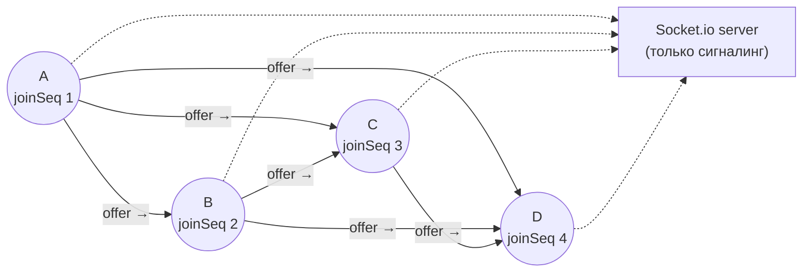
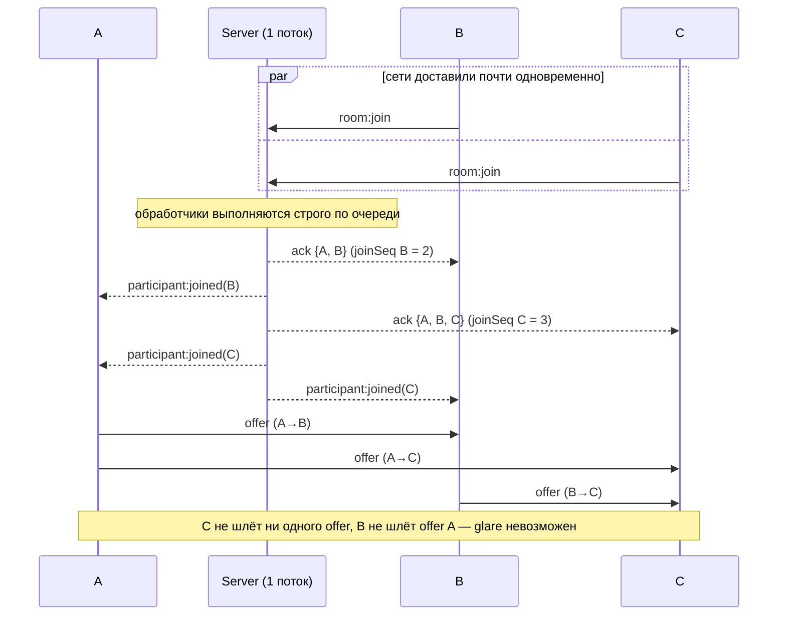
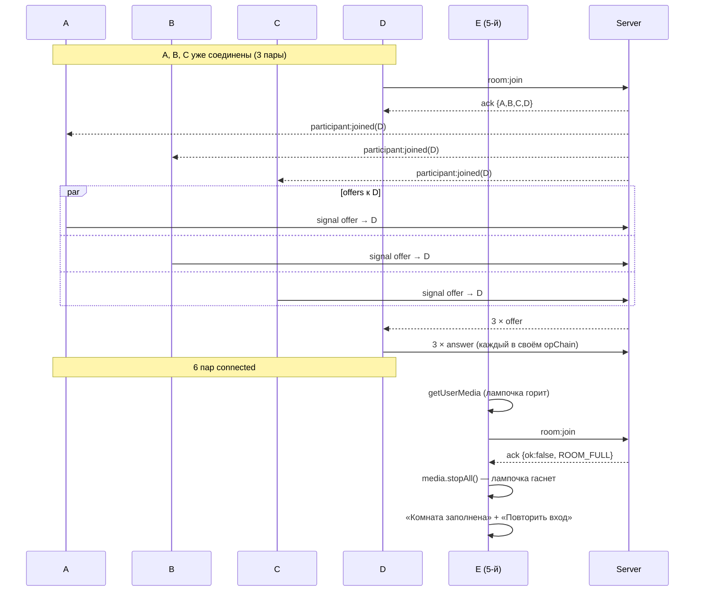
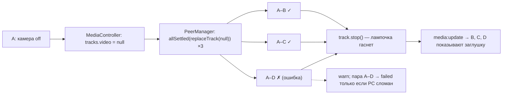

# TDD — Обобщение на mesh: групповой звонок до 4 участников

| | |
|---|---|
| **Документ** | Technical Design Document (TDD) |
| **feature-name** | `mesh-group-call` |
| **Этап** | 5 из 5 |
| **Версия** | 2.0 (Draft) |
| **Предыдущая версия** | [v1.0](design-mesh-group-call.md) |
| **Дата** | 2026-09-13 |
| **PRD** | [`prd-video-chat-room.md`](../../prd-video-chat-room.md) v1.0 |
| **Зависит от** | [1 — room-skeleton](../room-skeleton/design-room-skeleton-v2.md), [2 — chat-system-messages](../chat-system-messages/design-chat-system-messages-v2.md), [3 — local-media-controls](../local-media-controls/design-local-media-controls.md), [4 — webrtc-peer-call](../webrtc-peer-call/design-webrtc-peer-call.md) (инварианты I1–I4, `PeerSession`, `PeerManager`) |

> Документ описывает **только дельту**. Ядро WebRTC (инварианты I1–I4) спроектировано на этапе 4 сразу под `Map` сессий, поэтому здесь нет переписывания, только **доказательство корректности для N ≤ 4**, изоляция отказов, сетка, производительность и приёмочное тестирование всего продукта.

---

## Изменения в v2

| Раздел | Изменение | Основание |
|---|---|---|
| §1.1, §4.1, §13, §14 | Self-view — плитка в общей сетке, альтернатива с PiP снята | Решение по TBD-1 v1 |
| §2, §4.3, §5, §9, §11, §12, §13, §14 | Потолок битрейта видео 1000 kbps включён по умолчанию (в v1: Should, 600 kbps) | Решение по TBD-2 v1 |
| Шапка | Ссылки на этапы 1 и 2 ведут на v2 | — |

---

## 1. Overview / Контекст

### 1.1 Цель этапа

Довести звонок до требований PRD для **полной комнаты из 4 участников** в топологии mesh:

- адаптивная видеосетка 1–4 плитки (например, 2×2); self-view — плитка в общей сетке; порядок стабильный (FR-11);
- корректность согласования при **любом порядке и одновременности** входов и выходов, при N·(N−1)/2 = 6 соединениях;
- **изоляция отказов**: сбой одной пары или одного участника не ломает звонок остальным (US-11);
- контроль нагрузки: до 3 исходящих видеопотоков на клиента, задержка ≤ 500 мс в LAN (US-6);
- сквозная приёмка: E2E с 4 участниками + 5-й «Комната заполнена».

### 1.2 Покрываемые требования PRD

| Группа | Требования |
|---|---|
| Видео и аудио | FR 10, **FR 11 (сетка 1–4, self-view)**, FR 12 — для N участников |
| Лимит и жизненный цикл с медиа | FR 7, 8 (5-й участник с захваченным медиа), FR 29 (несколько вкладок), FR 31 (остальные продолжают звонок) |
| User Stories | US-5, US-6 (сетка, задержка), US-10, US-11 (звонок продолжается у остальных) |

#### Итоговая трассировка PRD → этапы

| FR | Этап(ы) | FR | Этап(ы) |
|---|---|---|---|
| 1–6 | 1 | 21–24 | 2 |
| 7–8 | 1 (сервер), 5 (приёмка с медиа) | 25 | 2 |
| 9 | 1, 2 (удаление истории) | 26 | 1 |
| 10 | 4, 5 | 27 | 1, 2 |
| 11 | 4 (пара), **5 (сетка)** | 28–30 | 1 (5 — приёмка с медиа) |
| 12 | 3 (self), 4 (удалённые) | 31 | 1, 2, **5 (звонок продолжается)** |
| 13–14 | 3 | 32 | 1 |
| 15–20 | 3 (локально + рассылка), 4 (у других) | 33 | 3 |
| — | — | 34 | 4 |
| — | — | 35–36 | 1 |
| — | — | 37 | 4 |
| — | — | 38 | 1 |
| — | — | 39 | 1 (имена), 2 (сообщения) |
| — | — | 40 | 2 |

### 1.3 Ограничения

- Лимит **4** зафиксирован PRD именно из-за mesh: у клиента 3 `RTCPeerConnection`, 3 кодирования и 3 декодирования видео.
- TURN, SFU, симулкаст, индикатор говорящего — вне скоупа.
- Потолок битрейта PRD не нормирует, он на усмотрение разработчика (§9).

---

## 2. Current Architecture & Codebase Summary

Состояние **после этапов 1–4** (спроектированные файлы; кода в репозитории на момент написания нет).

| Путь | Класс / функция | Назначение | Изменение на этапе 5 |
|---|---|---|---|
| `packages/server/src/rooms/RoomRegistry.ts` | `join` (атомарно, `joinSeq`), `leave` | Реестр | Без изменений |
| `packages/server/src/socket/handlers/signal.ts` | Relay + проверка ролей по `joinSeq` | Сигналинг | Без изменений |
| `packages/client/src/call/PeerSession.ts` | I2 трансиверы, I4 `pendingCandidates` + `opChain`, `close()` | Одна пара | + `applySendParameters()`: потолок битрейта видео 1000 kbps |
| `packages/client/src/call/PeerManager.ts` | `Map<participantId, PeerSession>`, маршрутизация сигналов, fan-out `replaceTrack` через `Promise.all` | Реестр пар | **`Promise.all` → `Promise.allSettled`** (изоляция отказов), try/catch вокруг каждой сессии, диагностика |
| `packages/client/src/features/call/VideoStage.tsx` | `SelfTile` + `RemoteTile[]` в flex-ряд | UI | Заменяется на `VideoGrid` |
| `packages/client/src/features/call/RemoteTile.tsx`, `VideoTile.tsx`, `AutoplayGuard.tsx` | Плитки, autoplay | UI | Без изменений в логике; стабильные ключи |
| `packages/client/src/media/MediaController.ts` | `VIDEO_CONSTRAINTS` 640×360@24 | Захват | Проверка нагрузки; при необходимости адаптация (§9) |
| `e2e/tests/*.spec.ts` | Сценарии этапов 1–4 (в основном 2 участника) | E2E | + `mesh-4.spec.ts` |

---

## 3. Proposed Architecture / High-Level Design

### 3.1 Топология комнаты из 4 участников



| Участник | Порядок входа | Шлёт offer | Отвечает (answer) | `RTCPeerConnection` |
|---|---|---|---|---|
| A | 1 | B, C, D | — | 3 |
| B | 2 | C, D | A | 3 |
| C | 3 | D | A, B | 3 |
| D | 4 | — | A, B, C | 3 |
| **Итого** | | 6 offer | 6 answer | 6 пар |

Направление offer всегда «от раньше вошедшего к позже вошедшему» (I1). Это **ориентированный ациклический граф**, согласованный с серверным порядком `joinSeq`.

### 3.2 Корректность I1 для N участников

**Утверждение.** Для любой пары (X, Y) при любых интерливингах входов и выходов ровно одна сторона создаёт сессию `offerer`, и ровно одна пара offer/answer проходит за время жизни пары.

**Обоснование.**
1. Сервер обрабатывает `room:join` в одном потоке. Для X и Y, находящихся в комнате одновременно, существует единственный порядок: `joinSeq(X) < joinSeq(Y)`.
2. В синхронном блоке join-хендлера Y сервер (а) делает снимок `participants`, куда входит X, (б) сажает Y в adapter-room, (в) отправляет ack Y, (г) рассылает `participant:joined(Y)` остальным, включая X. X получает событие о Y. Y получает X только в ack и **никогда** не получает `participant:joined(X)`: X вошёл раньше, и это событие было разослано до того, как Y оказался в adapter-room.
3. Клиент обрабатывает ack callback'ом синхронно (этап 1), так что порядок «ack → события» не нарушается даже при пакетной доставке.
4. Ренеготиаций нет (I3), поэтому второй offer в паре невозможен.
5. Если X или Y выходит, пара уничтожается у обоих (`participant:left` → `close()`). При повторном входе участник получает **новый** `participantId` и **новый** `joinSeq`, и появляется новая пара с однозначной ролью.
6. Сервер отбрасывает offer, нарушающий порядок `joinSeq` (защита в глубину).

**Одновременный вход B и C** (A уже в комнате):



### 3.3 Изоляция отказов

| Уровень | Механизм |
|---|---|
| Пара | Своё `RTCPeerConnection`, свой `opChain`, свой буфер кандидатов. `failed` одной пары меняет только её плитку |
| Fan-out смены трека | `Promise.allSettled` в `PeerManager`. Ошибка `replaceTrack` одной сессии не блокирует остальные и не задерживает `track.stop()` |
| Обработчики сигналов | `try/catch` вокруг `session.handleSignal`. Исключение переводит пару в `failed`, остальные пары и сокет живы |
| Участник | Выход или обрыв одного → `participant:left` → закрыта только его пара у каждого из остальных |
| Сервер | Relay без состояния: сбой пары не отражается на сервере |

---

## 4. Components & Interfaces

### 4.1 `features/call/VideoGrid.tsx` (заменяет `VideoStage`)

```tsx
interface VideoGridProps {
  selfId: string;
  participantIds: string[];          // порядок по joinedAt (из reducer)
}
```

- Порядок плиток: **self первой**, затем удалённые по `joinedAt`. Новые участники добавляются в конец, существующие плитки не переставляются. Это важно для непрерывности воспроизведения `<video>` со звуком.
- Ключ React — `participantId`. Плитка не пересоздаётся при входе или выходе других.
- Раскладка по количеству плиток (включая self):

```ts
export function getGridLayout(count: 1 | 2 | 3 | 4): { cols: number; rows: number; lastRowCentered: boolean } {
  switch (count) {
    case 1: return { cols: 1, rows: 1, lastRowCentered: false };
    case 2: return { cols: 2, rows: 1, lastRowCentered: false };
    case 3: return { cols: 2, rows: 2, lastRowCentered: true };   // 2 сверху, 1 по центру снизу
    case 4: return { cols: 2, rows: 2, lastRowCentered: false };  // 2×2
  }
}
```

CSS (эскиз):

```css
.video-grid {
  display: grid;
  grid-template-columns: repeat(var(--cols), minmax(0, 1fr));
  grid-template-rows: repeat(var(--rows), minmax(0, 1fr));
  gap: 8px;
  height: 100%;
  min-height: 0;
}
.video-grid[data-last-row-centered='true'] > :last-child {
  grid-column: 1 / -1;
  justify-self: center;
  width: calc(50% - 4px);
}
.video-tile video { width: 100%; height: 100%; object-fit: cover; }
.video-tile--self video { transform: scaleX(-1); }
```

- При одной плитке (участник один) поверх self-view показывается подсказка «Пока никого нет. Скопируйте ссылку и отправьте её участникам» с кнопкой `CopyLinkButton`.
- **Self-view — плитка в общей сетке** (решение v2): всегда первая, подпись «Вы», рамка, зеркалирование, `muted`. Отдельного PiP-окна нет.

### 4.2 `call/PeerManager.ts` (изменения)

```ts
// было (этап 4): Promise.all(...)
this.unsubscribe = deps.media.onTrackChange(async (kind, track) => {
  const results = await Promise.allSettled(
    [...this.sessions.values()].map((s) => s.replaceTrack(kind, track)),
  );
  results.forEach((r, i) => { if (r.status === 'rejected') console.warn('[peers] replaceTrack failed', r.reason); });
});

handleSignal(from: string, data: SignalData): void {
  try {
    /* маршрутизация этапа 4 */
  } catch (e) {
    this.markFailed(from, e);      // только эта пара
  }
}

/** Диагностика для DiagnosticsOverlay и E2E. */
getSummary(): Array<{ participantId: string; role: PeerRole; status: PeerStatus }>;
```

### 4.3 `call/PeerSession.ts` (потолок битрейта 1000 kbps)

```ts
/** Вызывается однократно после первого перехода в connected. */
private async applySendParameters(): Promise<void> {
  const sender = this.videoTx?.sender;
  if (!sender) return;
  const params = sender.getParameters();
  if (!params.encodings || params.encodings.length === 0) params.encodings = [{}]; // Firefox
  params.encodings[0].maxBitrate = MAX_VIDEO_BITRATE_BPS;                         // 1000 kbps
  try { await sender.setParameters(params); } catch (e) { console.warn('[peer] setParameters', e); }
}
```

- Без потолка libwebrtc (Chrome, Edge) допускает для 640×360 порядка 1.7 Mbps на поток. При 3 исходящих потоках потолок 1000 kbps снижает пиковый uplink примерно с 5 до 3 Mbps.
- `setParameters` **не вызывает ренеготиацию** (I3 соблюдён).
- Параметры кодирования живут на отправителе и сохраняются при `replaceTrack`.

### 4.4 `features/call/DiagnosticsOverlay.tsx` (Should, dev/E2E)

Показывается по `?debug=1` в dev-сборке. Раз в 2 с для каждой пары выводит из `getStats()`:

| Поле | Источник |
|---|---|
| Роль и статус | `PeerManager.getSummary()` |
| RTT | `candidate-pair[state=succeeded].currentRoundTripTime` |
| Jitter buffer delay | `inbound-rtp(video).jitterBufferDelay / jitterBufferEmittedCount` |
| Processing delay | `inbound-rtp(video).totalProcessingDelay / framesDecoded` (Chromium) |
| FPS вход/выход | `inbound-rtp.framesPerSecond`, `outbound-rtp.framesPerSecond` |
| Битрейт | Δ `bytesSent` / Δ `bytesReceived` |
| `qualityLimitationReason` | `outbound-rtp` (Chromium): `cpu` / `bandwidth` / `none` |

Оверлей не хранит данные и в prod-сборку не попадает.

---

## 5. Data Model & DB Changes

**Изменений нет.** БД нет. In-memory модель сервера (`Room`, `Participant{…, joinSeq, signalBucket}`) и клиентский state (`participants`, `peers`, `localMedia`, `chat`) полностью покрывают N ≤ 4.

Новые константы в `@vcr/shared/constants.ts`:

```ts
export const MAX_VIDEO_BITRATE_BPS = 1_000_000; // решение v2, §9
export const DIAGNOSTICS_INTERVAL_MS = 2_000;
```

---

## 6. API / Contracts

Новых событий нет. Ниже — **итоговый контракт v1** после всех этапов (справочник для реализации).

### 6.1 Клиент → сервер

| Событие | Payload | Ack | Этап |
|---|---|---|---|
| `room:join` | `{ roomId, name, media: {audio, video} }` | `{ ok, self, participants[], messages[] }` / `{ ok:false, error:{code} }` | 1 (+2 messages, +3 media) |
| `room:leave` | — | `{ ok }` | 1 |
| `chat:send` | `{ text }` | `{ ok, messageId }` / error | 2 |
| `media:update` | `{ audio, video }` | — | 3 |
| `signal` | `{ to, data: offer \| answer \| candidate }` | — | 4 |

### 6.2 Сервер → клиент

| Событие | Payload | Получатели | Этап |
|---|---|---|---|
| `participant:joined` | `{ participant: {id, name, joinedAt, media} }` | Все в комнате, кроме вошедшего | 1 (+3) |
| `participant:left` | `{ participantId }` | Все оставшиеся | 1 |
| `chat:message` | `{ message: ChatMessage }` | Все в комнате (для `joined` — кроме вошедшего) | 2 |
| `participant:media` | `{ participantId, media }` | Все, кроме отправителя | 3 |
| `signal` | `{ from, data }` | Один адресат | 4 |

### 6.3 Коды ошибок ack

`INVALID_PAYLOAD`, `INVALID_NAME`, `INVALID_ROOM_ID`, `ALREADY_JOINED`, `ROOM_FULL`, `NOT_IN_ROOM`, `INVALID_MESSAGE`, `RATE_LIMITED`, `INTERNAL`.

### 6.4 Объём сигналинга на полную комнату

| Событие | Количество при входе 4-го участника |
|---|---|
| `signal offer` | 3 (A→D, B→D, C→D) |
| `signal answer` | 3 |
| `signal candidate` | ~2–10 на сторону на пару (`max-bundle`) |
| Размер | ~6 × 8 KB SDP + кандидаты ≈ 60 KB |

---

## 7. Data & Control Flows

### 7.1 Заполнение комнаты и отказ 5-му



### 7.2 Выход участника из середины (US-11)

```mermaid
sequenceDiagram
  participant A
  participant B
  participant C as C (уходит)
  participant D
  participant IO as Server

  C--xIO: обрыв (ping timeout ≤ 15 с) / закрыл вкладку
  IO->>IO: leaveCurrentRoom(C): registry.leave, system msg
  IO-->>A: participant:left(C) + chat:message(system)
  IO-->>B: participant:left(C) + chat:message(system)
  IO-->>D: participant:left(C) + chat:message(system)
  A->>A: peers.close(C); плитка C исчезает; сетка 4→3
  B->>B: peers.close(C)
  D->>D: peers.close(C)
  Note over A,D: пары A–B, A–D, B–D не затронуты: ни одного нового offer
  Note over C: у C: CONNECTION_LOST → closeAll + stopAll → экран «Соединение прервано»
```

До прихода `participant:left` у оставшихся ICE пар с C может перейти в `unstable`/`failed`. Плитка C показывает «Связь нестабильна…», пока сервер не подтвердит выход.

### 7.3 Смена камеры при 3 активных парах



---

## 8. Error Handling & Edge Cases

| Ситуация | Поведение |
|---|---|
| Двое входят одновременно в комнату из 3 | Один получает `ROOM_FULL` (атомарность этапа 1), у него сразу `stopAll()`. Другой соединяется с тремя |
| Двое входят одновременно в комнату из 1–2 | Роли однозначны (§3.2), все пары соединяются |
| Перезагрузка страницы участником в **полной** комнате | Старый сокет обычно закрывается раньше нового входа. Если новый `room:join` пришёл раньше, чем сервер обработал `disconnect` старого (краш вкладки → ping timeout), выпадет `ROOM_FULL` + «Повторить вход». Через ≤ 15 с слот освободится |
| Выход участника во время согласования с новичком | `close()` прерывает `opChain` (этап 4, §7.3); остальные пары новичка продолжают согласование |
| Одна пара `failed` (строгий NAT между двумя участниками) | Плитка «Не удалось установить медиасоединение» **только у этих двоих друг для друга**; с остальными звонок идёт |
| Все, кроме одного, вышли | Сетка 1×1, подсказка «Пока никого нет» + ссылка. Комната жива |
| Последний вышел | Комната удалена (этап 1); повторный вход — новая комната |
| Две вкладки одного пользователя на одном устройстве (FR-29) | Два участника, пара между ними. **Акустическая обратная связь** (микрофон вкладки 1 слышит динамик вкладки 2) — вне контроля приложения. Echo cancellation частично помогает; для теста — наушники или mute |
| Несколько ноутбуков в одной физической комнате | То же (эхо). Рекомендация в README |
| CPU-перегрузка на слабом клиенте | Браузер сам снижает разрешение/fps (`qualityLimitationReason=cpu`); видно в `DiagnosticsOverlay`. См. §9 |
| Смена камеры во время 3 параллельных согласований | Каждый `replaceTrack` встаёт в `opChain` своей пары; итоговое состояние консистентно (этап 4) |
| Исключение при обработке сигнала одной пары | `failed` только этой пары (`try/catch` в `PeerManager`) |
| Autoplay заблокирован для нескольких плиток | Один баннер «Включить звук» → `resumeAll()` для всех зарегистрированных `<video>` |
| Порядок плиток при выходе участника из середины | Оставшиеся плитки сохраняют относительный порядок; React не пересоздаёт их (ключ `participantId`) |

---

## 9. Performance & Scalability

### 9.1 Нагрузка на клиента в полной комнате

| Ресурс | Значение (4 участника) |
|---|---|
| `RTCPeerConnection` | 3 |
| Кодирование видео | 3 × 640×360@24 (независимые энкодеры на отправителя) |
| Декодирование видео | 3 × 640×360 |
| Аудио | 3 × Opus encode + 3 × decode + микширование в браузере |
| Uplink | 3 × (видео ≤ 1000 kbps + аудио ~40 kbps) ≈ **≤ 3.2 Mbps** |
| Downlink | ≈ ≤ 3.2 Mbps |

### 9.2 Целевые метрики и приёмка

| Метрика | Цель | Как измеряем |
|---|---|---|
| Задержка медиа в LAN (US-6) | **≤ 500 мс** (glass-to-glass) | (1) Ручной: на экране A — секундомер с миллисекундами, камера B снимает экран A, скриншот экрана B с двумя значениями; 10 замеров, p95. (2) Оценка по `getStats`: `RTT/2 + jitterBufferDelay + processingDelay` + ~100 мс на захват/рендер |
| Время подключения 4-го участника ко всем | < 3 с p95 в LAN | E2E: от `JOIN_SUCCEEDED` до `connected` всех 3 пар |
| Принимаемый FPS | ≥ 20 fps на каждой плитке | `inbound-rtp.framesPerSecond` |
| `qualityLimitationReason` | Преимущественно `none` | `DiagnosticsOverlay` |
| Потери пакетов в LAN | < 1% | `inbound-rtp.packetsLost / packetsReceived` |
| Утечки | Число `RTCPeerConnection` = N−1 после серии входов/выходов | E2E-хук `peers.ids()`, `chrome://webrtc-internals` |

### 9.3 Рычаги, если метрики не выполняются

| Рычаг | Статус | Ренеготиация? |
|---|---|---|
| `maxBitrate = 1000 kbps` на видео-отправителе | **Включено по умолчанию** (§4.3); при перегрузке CPU снижается | Нет (`setParameters`) |
| Снижение захвата до 480×270@20 при N = 4 | TBD | Нет (`track.applyConstraints` на общем треке) |
| `scaleResolutionDownBy` на отдельных отправителях | TBD | Нет (`setParameters`) |
| Приоритет аудио (`priority: 'high'` для audio encoding) | Could | Нет |

Серверная масштабируемость не меняется относительно этапа 1: сервер несёт только сигналинг, медиа идёт P2P.

---

## 10. Security & Compliance

Новых поверхностей атаки нет. Уточнения для полной комнаты:

| Аспект | Мера |
|---|---|
| Раскрытие IP | Каждый участник видит srflx-кандидаты (публичный IP) **всех** остальных участников комнаты (до 3). Свойство mesh без TURN, принятое PRD (см. этап 4, §14) |
| Исчерпание ресурсов клиента чужими действиями | Число пар ограничено сервером (≤ 3 на клиента); сервер отбрасывает offer, нарушающий роли; rate limit сигналинга |
| Диагностика | `DiagnosticsOverlay` и `window.__vcr` не попадают в prod-сборку (проверка в CI) |
| Шифрование | DTLS-SRTP на каждой из 6 пар независимо |

---

## 11. Testing Strategy

### 11.1 Unit

| Модуль | Кейсы |
|---|---|
| `getGridLayout` | 1→1×1, 2→2×1, 3→2×2 с центрированием, 4→2×2 |
| `VideoGrid` (jsdom) | self первой; порядок по `joinedAt`; при выходе участника из середины DOM-узлы оставшихся `<video>` **те же** (сравнение ссылок) |
| `PeerManager` N=3 | Fan-out `replaceTrack`: одна сессия reject → остальные получили вызов, Promise подписчика резолвится; исключение в `handleSignal` одной пары → `failed` только у неё |
| `PeerSession.applySendParameters` | `maxBitrate === 1_000_000`; пустые `encodings` (Firefox) → создан `[{}]`; reject `setParameters` → warn, статус не меняется |

### 11.2 Property-based тест протокола ролей (Vitest + `fast-check`)

Цель — формально проверить I1 при произвольных интерливингах без браузера.

- Поднимается **настоящий сервер** (`createAppServer({ port: 0 })`) и K ∈ [2..6] клиентов `socket.io-client`.
- На каждом клиенте работает **настоящий `PeerManager`** с `FakePeerSession` (записывает роль и отправленные offer/answer, отвечает на offer синтетическим answer).
- `fast-check` генерирует последовательность команд: `join(i)`, `leave(i)`, `disconnect(i)`, `rejoin(i)`, `wait(ms)`, в том числе «в одном тике».
- **Свойства** после стабилизации:
  1. В комнате ≤ 4 участников; лишние получили `ROOM_FULL`.
  2. Для каждой живой пары (X, Y): ровно одна сторона — `offerer`, и это участник с меньшим `joinSeq`.
  3. На пару отправлено ровно 1 offer и 1 answer; сервер не залогировал ни одного `signal.role-violation`.
  4. У каждого клиента множество сессий = множество остальных живых участников (нет утечек и «призраков»).

### 11.3 Integration (сервер)

Без изменений по сравнению с этапами 1–4; добавить сценарий «4 клиента симулируют полный mesh-обмен сигналами: каждый получает ровно 3 сигнальных потока».

### 11.4 E2E (Playwright, `e2e/tests/mesh-4.spec.ts`)

Настройки: Chromium с флагами этапа 4; `workers: 1` для этого файла (5 браузерных контекстов с медиа тяжёлые); `retries: 1` в CI; fake-камера с пониженным разрешением через `VIDEO_CONSTRAINTS` E2E-сборки.

| # | Сценарий | Проверка |
|---|---|---|
| 1 | **Полная комната** | 4 контекста входят последовательно → у каждого 3 удалённые плитки с `videoWidth > 0`; `data-count="4"` у сетки; `peers.ids().length === 3` |
| 2 | **Отсутствие glare** | `signalCounts`: у A offer к B, C, D; у B к C, D; у C к D; у D — 0 offer. На пару ровно 1 offer |
| 3 | **5-й участник** | «Комната заполнена»; все треки 5-го `ended`; после выхода одного из 4 → «Повторить вход» → 5-й в комнате, 3 плитки |
| 4 | **Одновременный вход** | A в комнате; B и C кликают «Войти» через `Promise.all` → все 3 пары `connected` |
| 5 | **Выход из середины** | C закрывает страницу → у A, B, D по 2 удалённые плитки ≤ 2 с; `bytesReceived` пар A–B, A–D, B–D продолжает расти; число offer не изменилось |
| 6 | **Переключение камеры** | A выключает камеру → у B, C, D заглушка; включает → у всех трёх `framesDecoded` растёт; новых offer нет |
| 7 | **Изоляция пары** | Для D подменяется `RTCPeerConnection` так, что пара с C получает `iceTransportPolicy: 'relay'` → у C и D друг для друга «Не удалось установить медиасоединение», остальные 5 пар `connected` |
| 8 | **Сетка** | Скриншот-сравнение (`toHaveScreenshot`, маска на видео) для 1, 2, 3, 4 участников на ширине 1024 и 1440 |
| 9 | **Кросс-браузер (Should)** | Смешанная комната: 2 × Chromium + 1 × Firefox (fake-медиа через `firefoxUserPrefs`) → все пары `connected` |
| 10 | **Потолок битрейта** | Через 10 с звонка у каждого видео-отправителя `getParameters().encodings[0].maxBitrate === 1_000_000`; средний битрейт `outbound-rtp(video)` за 10 с ≤ 1.1 Mbps |

---

## 12. Deployment & Migration Plan

- Изменения только клиентские (сетка, `allSettled`, потолок битрейта 1000 kbps, диагностика). Серверный код и контракт не меняются.
- Feature flags не нужны. Rollback — `git revert` PR этапа (вернётся раскладка этапа 4, звонок останется рабочим).
- CI: отдельный Playwright-проект `mesh` (`workers: 1`, `timeout: 120s`) — можно запускать на `main` и по метке PR, если время прогона на каждом PR неприемлемо.

---

## 13. Risks & Mitigations

| Риск | Вероятность / влияние | Митигация |
|---|---|---|
| CPU/uplink слабого клиента не тянет 3 исходящих потока | Средняя / высокое (фризы у всех, кто его смотрит) | 640×360@24, `maxBitrate` 1000 kbps, рычаги §9.3 |
| Нестабильные E2E с 4–5 браузерными контекстами в CI | Высокая / среднее | `workers: 1`, `retries: 1`, пониженное разрешение fake-медиа, отдельный проект `mesh` |
| Скрытая ошибка в порядке ролей проявляется только при редком интерливинге | Низкая / высокое | Property-based тест (§11.2) + серверная проверка ролей |
| Одна «битая» пара влияет на остальные через общий fan-out | Средняя / среднее | `Promise.allSettled`, `try/catch` на пару, E2E #7 |
| Эхо при тестировании нескольких устройств в одном помещении воспринимается как баг | Высокая / низкое | README: наушники при тестировании |
| Асимметричная недостижимость (A видит B, B не видит A) | Низкая / среднее | ICE-пара общая для обоих направлений — `failed` виден обоим; ручная проверка через `webrtc-internals` |

---

## 14. Open Questions / TBD

**Решено в v2:**
- Self-view — плитка в общей сетке (§4.1).
- Потолок битрейта видео — 1000 kbps по умолчанию (§4.3, §9).

**Открыто:**
- **TBD-1:** Нужна ли адаптация разрешения захвата под число участников (480×270@20 при N = 4)?
- **TBD-3:** Нужен ли `DiagnosticsOverlay` в финальной сдаче (например, для демонстрации ≤ 500 мс) или только в dev?
- **TBD-4:** Порядок плиток — по времени входа (предложено) или «последний вошедший первым»? Изменение порядка существующих плиток нежелательно (§4.1).

**Решено по умолчанию:** property-based тест протокола ролей использует `fast-check` как dev-зависимость.
