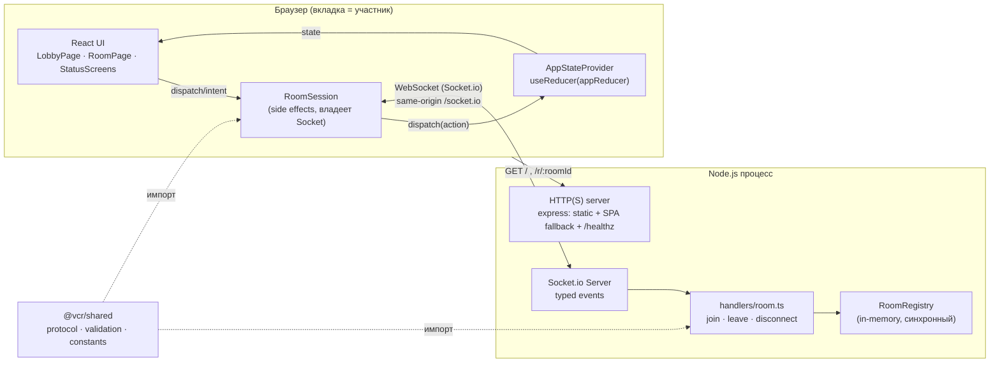
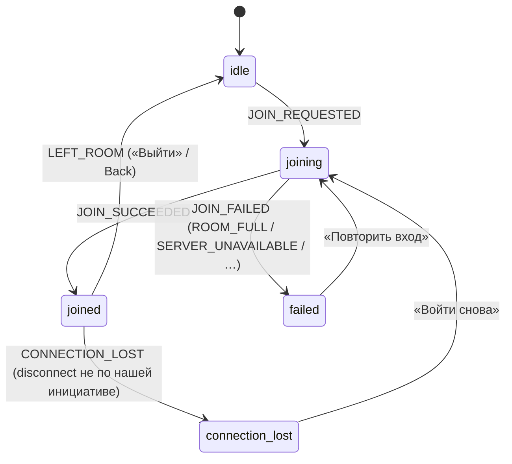
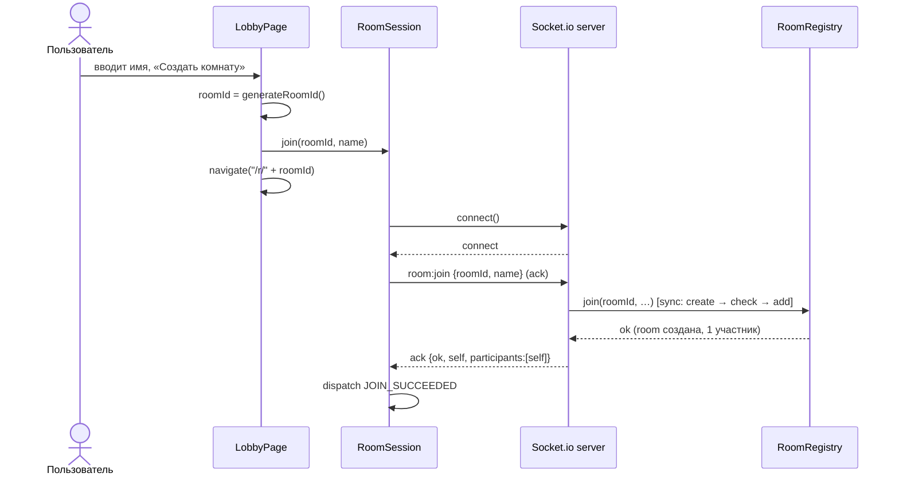
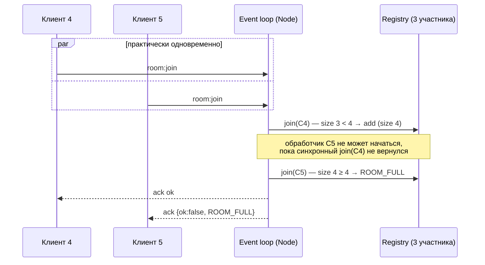

# TDD — Каркас: сокет-контракт, вход в комнату, список участников

| | |
|---|---|
| **Документ** | Technical Design Document (TDD) |
| **feature-name** | `room-skeleton` |
| **Этап** | 1 из 5 |
| **Версия** | 2.0 (Draft) |
| **Предыдущая версия** | [v1.0](design-room-skeleton.md) |
| **Дата** | 2026-09-13 |
| **PRD** | [`prd-video-chat-room.md`](../../prd-video-chat-room.md) v1.0 |
| **Зависит от** | — (первый этап) |
| **Следующие этапы** | [2 — chat-system-messages](../chat-system-messages/design-chat-system-messages-v2.md) · [3 — local-media-controls](../local-media-controls/design-local-media-controls.md) · [4 — webrtc-peer-call](../webrtc-peer-call/design-webrtc-peer-call.md) · [5 — mesh-group-call](../mesh-group-call/design-mesh-group-call-v2.md) |

---

## Изменения в v2

| Раздел | Изменение | Основание |
|---|---|---|
| §2, §3.2, §14 | `prds/**` отслеживаются в git. Добавлен TBD о расположении самого PRD | Решение по TBD-1 v1 |
| Шапка | Ссылки на этапы 2 и 5 ведут на v2 | — |

---

## 1. Overview / Контекст

### 1.1 Цель этапа

Заложить фундамент, на который встанут все следующие этапы:

- монорепозиторий (npm workspaces) со стеком **Node.js + TypeScript + Socket.io** на сервере и **React + Vite + useReducer** на клиенте, тесты — **Vitest + Playwright**;
- **типизированный сокет-контракт** в общем пакете `@vcr/shared`. Этапы 2–5 только расширяют его;
- создание комнаты, вход по ссылке, **атомарный лимит в 4 участника**, список участников в реальном времени;
- выход, закрытие вкладки, обрыв соединения и удаление комнаты после ухода последнего участника;
- экраны ошибок: «Комната заполнена», «Сервер недоступен», «Соединение с сервером прервано», «Нужен HTTPS», «WebRTC не поддерживается».

После этапа 1 приложение выглядит так: вводишь имя, создаёшь комнату, копируешь ссылку, второй человек входит по ней, и оба видят друг друга в списке участников. Видео и чата пока нет.

### 1.2 Покрываемые требования PRD

| Группа | Требования |
|---|---|
| Вход, комнаты, жизненный цикл | FR 1–9 (F-01…F-05) |
| Сессия и участники | FR 26–30, 32 (F-16, F-17, F-18 без медиа-части) |
| Окружение | FR 35, 36 (проверка поддержки WebRTC и secure context — только гейт) |
| Валидация | FR 38, 39 (в части имён) |
| User Stories | US-1, US-2, US-3, US-4, US-5, US-9 (список), US-10, US-11 (без медиа), US-13 (сервер/WebRTC) |

**Не входит:** чат и системные сообщения (этап 2), камера и микрофон (этап 3), WebRTC (этапы 4–5).

### 1.3 Ограничения

- Состояние только **в памяти одного процесса Node**. Нет БД, нет горизонтального масштабирования.
- **Автопереподключения нет** (PRD, Non-Goals). Клиент Socket.io запускается с `reconnection: false`.
- **На клиенте ничего не хранится** между перезагрузками: без localStorage, sessionStorage и cookies.
- Авторизации нет, доступ к комнате по идентификатору не ограничивается.
- Целевые браузеры: Chrome, Firefox, Edge 100+, ширина экрана от 1024px.

### 1.4 Зафиксированные решения (по итогам уточнений)

| Вопрос | Решение |
|---|---|
| Декомпозиция документации | 5 отдельных TDD. Этот документ задаёт общую архитектуру, остальные описывают только свою дельту |
| Структура репозитория | npm workspaces: `packages/shared`, `packages/server`, `packages/client`, плюс `e2e/` |
| Окружение | localhost и LAN. В dev — Vite с самоподписанным сертификатом, в prod-like режиме Node отдаёт статику и Socket.io с одного origin |
| Тестирование | Vitest (unit и integration с настоящими socket.io-клиентами) плюс Playwright E2E в Chromium с fake-медиа |

---

## 2. Current Architecture & Codebase Summary

Проект создаётся с нуля (greenfield). На момент написания в репозитории:

| Путь | Содержимое | Значение для дизайна |
|---|---|---|
| `prd-video-chat-room.md` | PRD v1.0, единственный источник требований | Исключён из git через `.gitignore` (коммит `chore(git): ignore local PRD file`). TDD в `prds/**` **отслеживаются в git** (решение v2). Ссылки из TDD на PRD работают только в локальной копии (см. §14) |
| `.gitignore` | Стандартный шаблон GitHub для Node.js (`node_modules/`, `dist`, `.env*`, `coverage`, …) + строка `prd-video-chat-room.md` | Уже покрывает артефакты сборки и `.env`. Добавить нужно `playwright-report/`, `test-results/`, `*.pem` (dev-сертификаты) |
| `.gitattributes` | Нормализация переносов строк | Без изменений |
| Git | `main` с коммитом `Initial commit`; TDD v1 и v2 — в ветке `docs/technical-design` | — |

Кода, схем БД и тестов нет, поэтому в разделах 3–4 вся структура **проектируемая**.

---

## 3. Proposed Architecture / High-Level Design

### 3.1 Компоненты



Принципы:

1. **Сервер — единственный источник правды** о составе комнат. Клиент ничего не решает сам: лимит, валидация и порядок входа определяются на сервере.
2. **Контракт в одном месте.** Типы событий Socket.io описаны в `@vcr/shared/protocol.ts` и подставляются в дженерики `Server<…>` и `Socket<…>` с обеих сторон. Если контракт разойдётся, сборка упадёт на `tsc`.
3. **Reducer чистый, side effects вынесены в `RoomSession`.** Сокеты, а на следующих этапах `MediaStream` и `RTCPeerConnection`, в state не попадают. State остаётся сериализуемым и легко тестируется.
4. **Same-origin.** Клиент подключается через `io()` без URL. В dev запросы на `/socket.io` проксирует Vite, в prod-like режиме статику и сокеты отдаёт один процесс Node. CORS не нужен.

### 3.2 Структура репозитория

```text
video-chat-room/
├─ prds/                        # TDD по этапам (отслеживаются в git)
├─ package.json                 # workspaces: ["packages/*", "e2e"], корневые скрипты
├─ tsconfig.base.json           # strict, ES2022, moduleResolution: bundler
├─ vitest.config.ts             # test.projects: ["packages/*"]
├─ eslint.config.js             # typescript-eslint, react-hooks, react/no-danger: error
├─ packages/
│  ├─ shared/                   # @vcr/shared — только чистый TS без зависимостей от DOM/Node
│  │  └─ src/{index,constants,validation,protocol,ids}.ts
│  ├─ server/                   # @vcr/server
│  │  ├─ src/
│  │  │  ├─ index.ts            # bootstrap: читает config, вызывает createAppServer().listen()
│  │  │  ├─ config.ts           # PORT, HOST, TLS_*, CLIENT_DIST_DIR, SOCKET_PING_*
│  │  │  ├─ app.ts              # createAppServer(opts) → { httpServer, io, registry, listen, close }
│  │  │  ├─ logger.ts           # тонкая обёртка над console с уровнями (без PII)
│  │  │  ├─ rooms/RoomRegistry.ts
│  │  │  ├─ rooms/types.ts
│  │  │  └─ socket/
│  │  │     ├─ schemas.ts       # zod-схемы входящих payload
│  │  │     ├─ registerSocketHandlers.ts
│  │  │     ├─ handlers/room.ts
│  │  │     └─ leaveCurrentRoom.ts
│  │  └─ test/{unit,integration}/…
│  └─ client/                   # @vcr/client
│     ├─ index.html
│     ├─ vite.config.ts         # basicSsl, host: true, proxy /socket.io → :3000 (ws)
│     └─ src/
│        ├─ main.tsx, App.tsx
│        ├─ app/router.ts       # useRoute(), navigate(); маршруты "/" и "/r/:roomId"
│        ├─ app/environment.ts  # checkEnvironment()
│        ├─ net/createSocket.ts # типизированная фабрика io()
│        ├─ session/RoomSession.ts
│        ├─ state/appReducer.ts, actions.ts, selectors.ts
│        ├─ state/AppStateProvider.tsx
│        ├─ features/lobby/{LobbyPage,NameForm}.tsx
│        ├─ features/room/{RoomPage,RoomHeader,ParticipantList,CopyLinkButton}.tsx
│        └─ features/status/StatusScreen.tsx
└─ e2e/                         # Playwright
   ├─ playwright.config.ts
   └─ tests/room-skeleton.spec.ts
```

### 3.3 Технологии и инструменты

| Область | Выбор | Обоснование |
|---|---|---|
| Runtime | Node.js ≥ 22 LTS, ESM (`"type": "module"`) | Глобальный `crypto` (`randomUUID`, `getRandomValues`), стабильный `fetch` для тестов |
| Сервер | `socket.io` 4.x, `express` (статика и SPA fallback), `zod` (валидация payload) | Express нужен только для статики, а zod даёт строгий разбор недоверенного ввода |
| Клиент | React 19, Vite, `socket.io-client` 4.x, `@vitejs/plugin-basic-ssl` | Роутер не подключаем: маршрутов два, хватает History API |
| Сборка | Vite для клиента, `tsup` для сервера (бандлит `@vcr/shared`) | `@vcr/shared` экспортирует TS-исходники (`"exports": "./src/index.ts"`), отдельная сборка shared не нужна |
| Dev | `tsx watch` для сервера, `vite` для клиента, `concurrently` в корневом `npm run dev` | — |
| Тесты | Vitest (projects), `@testing-library/react` + jsdom, Playwright | — |
| Линт | ESLint (typescript-eslint, eslint-plugin-react-hooks, `react/no-danger: error`), Prettier | `no-danger` исключает `dangerouslySetInnerHTML` как класс XSS |

---

## 4. Components & Interfaces

### 4.1 `@vcr/shared`

#### `constants.ts`

```ts
export const MAX_PARTICIPANTS = 4;
export const NAME_MAX_LENGTH = 30;            // в code points
export const ROOM_ID_PATTERN = /^[A-Za-z0-9_-]{1,64}$/;
export const GENERATED_ROOM_ID_LENGTH = 12;   // 72 бита энтропии
export const ACK_TIMEOUT_MS = 5_000;
export const CONNECT_TIMEOUT_MS = 5_000;
```

#### `validation.ts`

Одни и те же функции работают на клиенте (UX-подсказки) и на сервере (окончательная проверка).

```ts
/** NFC → схлопывание пробельных символов → trim. */
export function normalizeName(raw: string): string;

export type NameValidation =
  | { ok: true; value: string }
  | { ok: false; reason: 'EMPTY' | 'TOO_LONG' | 'FORBIDDEN_CHARS' };

/** Разрешено: буквы любых алфавитов, диакритика, цифры, пробел, `.`, `_`, `-`.
 *  Хотя бы один символ — буква или цифра. Длина 1..30 code points. */
export function validateName(raw: string): NameValidation;
// NAME_PATTERN = /^[\p{L}\p{M}\p{N} ._-]+$/u, плюс /[\p{L}\p{N}]/u

export function isValidRoomId(id: string): boolean;
```

> Нормализация в NFC обязательна: без неё «й», набранная в декомпозированной форме (`и` + U+0306), не пройдёт проверку по `\p{L}`.

#### `ids.ts`

```ts
/** 12 символов из алфавита [A-Za-z0-9_-] через crypto.getRandomValues (работает и в браузере, и в Node). */
export function generateRoomId(): string;
```

#### `protocol.ts` (контракт этапа 1)

```ts
export interface ParticipantDTO {
  id: string;        // UUID, генерирует сервер; в UI не показывается
  name: string;      // нормализованное имя
  joinedAt: number;  // epoch ms, серверные часы; задаёт порядок
}

export type ServerErrorCode =
  | 'INVALID_PAYLOAD'
  | 'INVALID_NAME'
  | 'INVALID_ROOM_ID'
  | 'ALREADY_JOINED'
  | 'ROOM_FULL'
  | 'NOT_IN_ROOM'
  | 'INTERNAL';

export type AckError = { ok: false; error: { code: ServerErrorCode } };
export type Ack<T extends object = object> = ({ ok: true } & T) | AckError;

export interface JoinRequest { roomId: string; name: string }
export type JoinAck = Ack<{
  self: ParticipantDTO;
  participants: ParticipantDTO[]; // все участники, включая self, по joinedAt
}>;

export interface ClientToServerEvents {
  'room:join': (req: JoinRequest, ack: (res: JoinAck) => void) => void;
  'room:leave': (ack: (res: Ack) => void) => void;
}

export interface ServerToClientEvents {
  'participant:joined': (e: { participant: ParticipantDTO }) => void;
  'participant:left': (e: { participantId: string }) => void;
}

export interface InterServerEvents {}

export interface SocketData {
  roomId?: string;
  participantId?: string;
}
```

**Правила эволюции контракта (этапы 2–5):**
- Новые события и поля только **добавляются**. Переименование или удаление требует явного решения в новом TDD.
- Имена событий строятся по схеме `домен:действие` (`room:*`, `participant:*`, `chat:*`, `media:*`, `signal`). Зарезервированные имена Socket.io (`connect`, `disconnect`, `disconnecting`, `error`, `newListener`, `removeListener`) не используются.
- Команды от клиента, у которых есть осмысленный результат, отвечают через **ack** (join, leave, chat:send). Потоковые события без результата (media, signal) идут fire-and-forget.

### 4.2 Сервер

#### `rooms/types.ts`

```ts
export interface Participant {
  id: string;        // UUID
  socketId: string;  // только для адресной доставки; наружу не отдаётся
  name: string;
  joinedAt: number;
}

export interface Room {
  id: string;
  createdAt: number;
  participants: Map<string, Participant>; // порядок вставки = порядок входа
}
```

#### `rooms/RoomRegistry.ts`

Единственное место, где меняется состояние комнат. **Все методы синхронные**, и в этом весь смысл, см. §4.2.1.

```ts
export type JoinResult =
  | { ok: true; room: Room; participant: Participant }
  | { ok: false; reason: 'ROOM_FULL' };

export interface LeaveResult {
  participant: Participant;
  roomDeleted: boolean;
}

export class RoomRegistry {
  constructor(opts?: { maxParticipants?: number; now?: () => number });

  /** Атомарно: создать комнату при отсутствии → проверить лимит → добавить. */
  join(roomId: string, input: Omit<Participant, 'joinedAt'>): JoinResult;

  /** Идемпотентно: повторный вызов вернёт null. Удаляет пустую комнату. */
  leave(roomId: string, participantId: string): LeaveResult | null;

  getRoom(roomId: string): Readonly<Room> | undefined;
  getParticipant(roomId: string, participantId: string): Readonly<Participant> | undefined;
  listParticipants(roomId: string): ParticipantDTO[];
  get roomCount(): number;
}
```

##### 4.2.1 Атомарность лимита (FR-7, US-5)

Node исполняет JS в одном потоке. Если между «проверить размер» и «добавить» **нет `await`**, никакой другой обработчик не вклинится между ними. Это свойство нужно не просто соблюдать, а **закрепить в коде**:

```ts
// RoomRegistry.join — эскиз
join(roomId, input) {
  const existing = this.rooms.get(roomId);
  if (existing && existing.participants.size >= this.maxParticipants) {
    return { ok: false, reason: 'ROOM_FULL' };
  }
  const room = existing ?? { id: roomId, createdAt: this.now(), participants: new Map() };
  if (!existing) this.rooms.set(roomId, room);
  const participant = { ...input, joinedAt: this.now() };
  room.participants.set(participant.id, participant);
  return { ok: true, room, participant };
}
```

Как не сломать гарантию:

| Анти-паттерн | Почему ломает атомарность |
|---|---|
| Проверка через `await io.in(room).fetchSockets()` или `allSockets()` | Асинхронный вызов: пока ждём, успеет войти второй клиент |
| Разнести `check` и `add` по разным функциям и добавить между ними `await` (логирование в БД, ожидание медиа и т.п.) | То же самое |
| Считать заполненность по адаптеру Socket.io (`io.sockets.adapter.rooms.get(id).size`) | С in-memory-адаптером это синхронно, но при смене адаптера (Redis) вызов станет асинхронным. Кроме того, в adapter-room сокет попадает уже после проверки |

Как гарантия закрепляется:
1. `check + add` живут внутри **одного синхронного метода** `RoomRegistry.join`. Тип возврата `JoinResult`, а не `Promise`, так что `await` внутрь незаметно не добавить.
2. Integration-тест «гонка за последний слот» (§11) ловит регресс, если кто-то разнесёт логику по асинхронным шагам.
3. Любая асинхронная работа (если появится) делается **до** `registry.join`, но не между проверкой и добавлением.

#### `socket/schemas.ts`

```ts
export const JoinRequestSchema = z.object({
  roomId: z.string().max(64),  // формат проверяет isValidRoomId → INVALID_ROOM_ID
  name: z.string().max(200),   // грубый потолок до нормализации; точная проверка — validateName
}).strict();
```

#### `socket/handlers/room.ts`

```ts
export function registerRoomHandlers(ctx: HandlerContext, socket: AppSocket): void;
// HandlerContext = { io: AppServer; registry: RoomRegistry; logger: Logger }
```

Эскиз критичного фрагмента:

```ts
socket.on('room:join', (raw, ack) => {
  if (typeof ack !== 'function') return;                       // клиент без ack — игнор
  const parsed = JoinRequestSchema.safeParse(raw);
  if (!parsed.success) return ack(fail('INVALID_PAYLOAD'));
  if (!isValidRoomId(parsed.data.roomId)) return ack(fail('INVALID_ROOM_ID'));
  const name = validateName(parsed.data.name);
  if (!name.ok) return ack(fail('INVALID_NAME'));
  if (socket.data.roomId) return ack(fail('ALREADY_JOINED'));

  // ── атомарная секция: НЕТ await ─────────────────────────────
  const result = ctx.registry.join(parsed.data.roomId, {
    id: randomUUID(), socketId: socket.id, name: name.value,
  });
  if (!result.ok) return ack(fail('ROOM_FULL'));
  socket.data.roomId = parsed.data.roomId;
  socket.data.participantId = result.participant.id;
  socket.join(adapterRoom(parsed.data.roomId));                 // in-memory adapter: синхронно
  // ────────────────────────────────────────────────────────────

  ack({ ok: true, self: toDTO(result.participant),
        participants: ctx.registry.listParticipants(parsed.data.roomId) });
  socket.to(adapterRoom(parsed.data.roomId))
        .emit('participant:joined', { participant: toDTO(result.participant) });
});

socket.on('room:leave', (ack) => { leaveCurrentRoom(ctx, socket); ack?.({ ok: true }); });
socket.on('disconnect', () => leaveCurrentRoom(ctx, socket));
```

- `adapterRoom(id) = \`room:${id}\``. Префикс обязателен: Socket.io автоматически сажает каждый сокет в комнату с именем его `socket.id`, и без префикса `roomId`, совпавший с чьим-то `socket.id`, доставлял бы broadcast не тем адресатам.
- Порядок «сначала `ack` newcomer'у, потом broadcast остальным» на этапе 4 определит, кто шлёт offer (см. [этап 4, §4](../webrtc-peer-call/design-webrtc-peer-call.md)).

#### `socket/leaveCurrentRoom.ts`

```ts
/** Идемпотентный выход: вызывается из room:leave и из disconnect. */
export function leaveCurrentRoom(ctx: HandlerContext, socket: AppSocket): void {
  const { roomId, participantId } = socket.data;
  if (!roomId || !participantId) return;
  socket.data.roomId = undefined;
  socket.data.participantId = undefined;
  const res = ctx.registry.leave(roomId, participantId);
  socket.leave(adapterRoom(roomId));
  if (res && !res.roomDeleted) {
    ctx.io.to(adapterRoom(roomId)).emit('participant:left', { participantId });
  }
}
```

Следующие этапы расширяют `join`-хендлер и `leaveCurrentRoom` **явными синхронными вызовами** сервисов: этап 2 добавляет системное сообщение и историю в ack, этап 3 — медиа-состояние. EventEmitter здесь не используем: ack на join должен синхронно собрать данные нескольких модулей, а неявные подписчики скрывают порядок операций, от которого зависит корректность.

#### `app.ts`

```ts
export interface AppServerOptions {
  port: number;               // 0 — эфемерный порт (тесты)
  host?: string;              // '0.0.0.0' для LAN
  tls?: { keyPath: string; certPath: string };
  clientDistDir?: string;     // если задан — express.static + SPA fallback
  pingIntervalMs?: number;
  pingTimeoutMs?: number;
}

export function createAppServer(opts: AppServerOptions): {
  httpServer: http.Server | https.Server;
  io: AppServer;
  registry: RoomRegistry;
  listen(): Promise<{ port: number }>;
  close(): Promise<void>;
};
```

Параметры Socket.io:

| Опция | Значение | Причина |
|---|---|---|
| `pingInterval` | 10 000 мс | Обрыв обнаруживается максимум за ~15 с (US-11). Дефолтные 25 с + 20 с дают до 45 с «зависшей» плитки |
| `pingTimeout` | 5 000 мс | — |
| `maxHttpBufferSize` | 100 KB | На этапе 4 по сокету пойдут SDP (~5–10 KB). Дефолтный 1 MB избыточен |
| `serveClient` | `false` | Клиент берём из бандла Vite |
| `connectionStateRecovery` | не включаем | Противоречит «без автопереподключения» |
| `cors` | не настраиваем | Same-origin |

### 4.3 Клиент

#### `app/environment.ts`

```ts
export type EnvironmentCheck = 'ok' | 'insecure-context' | 'webrtc-unsupported';
export function checkEnvironment(win: Window = window): EnvironmentCheck;
// 1) !win.isSecureContext                        → 'insecure-context'
// 2) !win.RTCPeerConnection || !navigator.mediaDevices?.getUserMedia → 'webrtc-unsupported'
```

> Порядок проверок важен. На `http://192.168.x.x` `navigator.mediaDevices` равен `undefined`, и без первой проверки пользователь увидел бы ложное «WebRTC не поддерживается» вместо «Откройте по HTTPS».

Гейт срабатывает в `App.tsx` до рендера страниц.

#### `app/router.ts`

```ts
export type Route = { name: 'lobby' } | { name: 'room'; roomId: string } | { name: 'invalid-link' };
export function parseRoute(pathname: string): Route;  // "/r/:roomId" с isValidRoomId
export function useRoute(): Route;                    // подписка на popstate + собственное событие
export function navigate(path: string, opts?: { replace?: boolean }): void; // history.pushState
```

#### `net/createSocket.ts`

```ts
export type AppClientSocket = Socket<ServerToClientEvents, ClientToServerEvents>;
export function createSocket(): AppClientSocket {
  return io({ autoConnect: false, reconnection: false, timeout: CONNECT_TIMEOUT_MS });
}
```

**Один сокет на одну сессию в комнате.** Сокет создаётся при входе и отключается при выходе или ошибке. Так жизненный цикл сокета совпадает с жизненным циклом участника, а повторный вход автоматически получается «новым участником» (FR-28, FR-31).

#### `state/appReducer.ts`

```ts
export type JoinFailure = 'ROOM_FULL' | 'SERVER_UNAVAILABLE' | 'INVALID_NAME' | 'INTERNAL';

export type SessionPhase =
  | { kind: 'idle' }
  | { kind: 'joining' }
  | { kind: 'joined' }
  | { kind: 'failed'; reason: JoinFailure }
  | { kind: 'connection-lost' };

export interface AppState {
  displayName: string | null;          // только в памяти
  roomId: string | null;
  phase: SessionPhase;
  selfId: string | null;
  participantIds: string[];            // порядок = joinedAt
  participantsById: Record<string, ParticipantDTO>;
}

export type AppAction =
  | { type: 'JOIN_REQUESTED'; roomId: string; name: string }
  | { type: 'JOIN_SUCCEEDED'; self: ParticipantDTO; participants: ParticipantDTO[] }
  | { type: 'JOIN_FAILED'; reason: JoinFailure }
  | { type: 'PARTICIPANT_JOINED'; participant: ParticipantDTO }
  | { type: 'PARTICIPANT_LEFT'; participantId: string }
  | { type: 'CONNECTION_LOST' }
  | { type: 'LEFT_ROOM' };
```

Инварианты reducer'а:
- `PARTICIPANT_JOINED` и `PARTICIPANT_LEFT` вне фазы `joined` игнорируются. `PARTICIPANT_JOINED` для уже известного id работает как upsert, `PARTICIPANT_LEFT` для неизвестного id ничего не делает.
- `LEFT_ROOM` и `JOIN_FAILED` сбрасывают участников, но **сохраняют `displayName`**, чтобы кнопка «Повторить вход» не просила имя заново (в пределах жизни вкладки, это не противоречит «ничего не хранить между перезагрузками»).



#### `session/RoomSession.ts`

Владелец побочных эффектов. Создаётся **один раз** в `AppStateProvider` через `useRef` и не зависит от mount/unmount страниц.

```ts
export class RoomSession {
  constructor(deps: { dispatch: Dispatch<AppAction>; createSocket?: () => AppClientSocket });
  join(roomId: string, name: string): void;   // no-op, если фаза не idle/failed/connection-lost
  leave(): void;                              // room:leave (ack до 2 c) → socket.disconnect()
  dispose(): void;
}
```

Поведение `join`:
1. `dispatch(JOIN_REQUESTED)`.
2. Создать сокет и **до `connect()`** навесить все слушатели: `participant:*`, `disconnect`, `connect_error`.
3. `socket.connect()`. Если пришёл `connect_error` или не уложились в `CONNECT_TIMEOUT_MS`, выполняется `JOIN_FAILED(SERVER_UNAVAILABLE)`.
4. `socket.timeout(ACK_TIMEOUT_MS).emit('room:join', req, (err, res) => …)`: **обязательно в callback-стиле, без `emitWithAck`** (см. ниже).
5. При `ok` выполняется `JOIN_SUCCEEDED`. Иначе `JOIN_FAILED(code)` и `socket.disconnect()`.
6. Если `disconnect` пришёл в фазе `joined` и `reason !== 'io client disconnect'`, выполняется `CONNECTION_LOST`.

> **Почему callback-ack, а не `await emitWithAck`.** При polling-транспорте engine.io может прислать ack и следующее событие (например, `participant:left`) **в одной пачке** и обработать их синхронно одно за другим. Продолжение после `await` выполняется как microtask, то есть **уже после** обработчика события. Тогда reducer получит `PARTICIPANT_LEFT(C)` раньше `JOIN_SUCCEEDED([…, C])`, и в списке появится «призрак» C. Callback выполняется синхронно в порядке пакетов, и порядок сохраняется.

> **Почему join вызывается из обработчика submit, а не из `useEffect`.** В dev React StrictMode монтирует эффекты дважды, и вход из эффекта дал бы два сокета или `ALREADY_JOINED`. Вход инициирует явное действие пользователя, и это же служит «жестом» для autoplay (FR-37, этап 4).

#### Страницы и компоненты

| Компонент | Ответственность |
|---|---|
| `App.tsx` | Гейт окружения → `AppStateProvider` → переключение по `useRoute()` |
| `LobbyPage` | `NameForm` + кнопка «Создать комнату»: `roomId = generateRoomId()` → `session.join(roomId, name)` → `navigate('/r/' + roomId)` |
| `RoomPage` | Если `displayName === null` (открыли ссылку), показывает `NameForm` с кнопкой «Войти». Иначе рендер по `phase`: `joining` → спиннер, `joined` → комната, `failed`/`connection-lost` → `StatusScreen` |
| `NameForm` | `<input maxLength={30}>` (обрезает ввод и вставку, FR-38), живая подсказка из `validateName`, кнопка неактивна, пока имя невалидно |
| `RoomHeader` | Идентификатор комнаты, `CopyLinkButton`, кнопка «Выйти» |
| `CopyLinkButton` | `navigator.clipboard.writeText(location.href)` → тост «Ссылка скопирована». Fallback: поле с выделенным URL, «скопируйте вручную» |
| `ParticipantList` | Имена по `joinedAt`, пометка «(вы)» для `selfId`. Имена выводятся **текстовыми узлами React** |
| `StatusScreen` | Тексты и действия по причине, §8 |

Навигация «Назад»: `AppStateProvider` слушает `popstate`. Если пользователь ушёл с `/r/:id` в фазе `joined`, вызывается `session.leave()`. На `pagehide` вызывается `socket.disconnect()` (браузер и так закроет WS, это ускоряет уведомление).

---

## 5. Data Model & DB Changes

**БД нет** (PRD §7), миграций и SQL тоже нет. Модель данных — структуры в памяти процесса Node (§4.2).

| Сущность | Где живёт | Время жизни | Ключ |
|---|---|---|---|
| `Room` | `RoomRegistry.rooms: Map<roomId, Room>` | С первого `join` до выхода последнего участника | `roomId` (из URL) |
| `Participant` | `Room.participants: Map<participantId, Participant>` | От `join` до `leave`/`disconnect` | UUID v4 |
| Привязка сокета | `socket.data.{roomId, participantId}` | Время жизни сокета | — |

Инварианты:
1. `0 < room.participants.size ≤ 4` для любой комнаты в `rooms`. Пустых комнат не бывает.
2. Сокет состоит максимум в одной комнате (`ALREADY_JOINED`).
3. `participant.id` уникален глобально (UUID), имена могут повторяться (FR-30).
4. После удаления комнаты не остаётся ссылок на её данные. Повторный `join` с тем же `roomId` создаёт новый объект `Room` (FR-9).

Оценка памяти: комната на этапе 1 весит меньше 1 KB. На этапе 2 добавится история чата (≤ 200 сообщений × ≤ 1 KB ≈ 200 KB на комнату).

---

## 6. API / Contracts

### 6.1 HTTP

| Метод | Путь | Ответ |
|---|---|---|
| `GET` | `/` | `index.html` клиента (prod-like режим) |
| `GET` | `/r/:roomId` | `index.html` (SPA fallback) |
| `GET` | `/assets/*` | Статика Vite (`Cache-Control: immutable`) |
| `GET` | `/healthz` | `200 {"status":"ok","rooms":3,"uptimeSec":1234}` |
| `*` | `/socket.io/*` | Socket.io (engine.io) |

В dev этим занимается Vite: он отдаёт клиент и проксирует `/socket.io` на Node.

### 6.2 Socket.io — события этапа 1

#### `room:join` (C→S, ack)

```json
// request
{ "roomId": "q7Z3kP0aX_2m", "name": "Алекс" }

// ack — успех
{
  "ok": true,
  "self": { "id": "8b0f…c1", "name": "Алекс", "joinedAt": 1789300000000 },
  "participants": [
    { "id": "1d2e…9a", "name": "Мария", "joinedAt": 1789299990000 },
    { "id": "8b0f…c1", "name": "Алекс", "joinedAt": 1789300000000 }
  ]
}

// ack — ошибка
{ "ok": false, "error": { "code": "ROOM_FULL" } }
```

#### `room:leave` (C→S, ack)

```json
// request: без payload
// ack
{ "ok": true }
```

#### `participant:joined` (S→C, всем в комнате, кроме вошедшего)

```json
{ "participant": { "id": "8b0f…c1", "name": "Алекс", "joinedAt": 1789300000000 } }
```

#### `participant:left` (S→C, всем оставшимся)

```json
{ "participantId": "8b0f…c1" }
```

### 6.3 Коды ошибок

| Код | Когда | Реакция клиента |
|---|---|---|
| `INVALID_PAYLOAD` | Payload не прошёл zod-схему | `JOIN_FAILED(INTERNAL)` + лог в консоль (признак бага клиента) |
| `INVALID_NAME` | Имя не прошло `validateName` на сервере | Вернуть на `NameForm` с подсказкой |
| `INVALID_ROOM_ID` | `roomId` не соответствует `ROOM_ID_PATTERN` (клиент такие id не отправляет, см. `invalid-link`) | Экран «Некорректная ссылка» |
| `ALREADY_JOINED` | Повторный `room:join` с того же сокета | Не должно случаться; `INTERNAL` |
| `ROOM_FULL` | В комнате уже 4 участника | «Комната заполнена» + «Повторить вход» |
| `NOT_IN_ROOM` | Событие комнаты от сокета вне комнаты (используется с этапа 2) | Игнор / `CONNECTION_LOST` |
| `INTERNAL` | Непойманное исключение в хендлере | «Что-то пошло не так» + «Повторить вход» |

Клиентские (не серверные) причины: `SERVER_UNAVAILABLE`, `CONNECTION_LOST`, `insecure-context`, `webrtc-unsupported`.

---

## 7. Data & Control Flows

### 7.1 Создание комнаты (US-2)



### 7.2 Вход по ссылке и уведомление остальных (US-4, US-9)

```mermaid
sequenceDiagram
  participant B as Клиент B (новичок)
  participant IO as Server
  participant R as Registry
  participant A as Клиент A (в комнате)

  B->>IO: room:join {roomId, "Борис"}
  IO->>R: join()  [sync]
  R-->>IO: ok
  IO->>IO: socket.join("room:"+roomId)
  IO-->>B: ack {self:B, participants:[A,B]}
  IO-->>A: participant:joined {B}
  Note over IO: Порядок «ack новичку → broadcast старожилам»<br/>фиксирован; на нём строится правило offer (этап 4)
```

### 7.3 Гонка за последний слот (US-5)



### 7.4 Выход, закрытие вкладки, обрыв, удаление комнаты (US-10, US-11)

| Триггер | Что происходит на сервере | Как быстро видят остальные |
|---|---|---|
| «Выйти» | `room:leave` → `leaveCurrentRoom` → `participant:left`. Клиент отключает сокет | Сразу |
| Закрытие вкладки | Браузер закрывает WS → `disconnect` → `leaveCurrentRoom` | Сразу (≤ 1 с) |
| Перезагрузка | То же, что закрытие вкладки. Новая загрузка приходит без имени, и вход считается новым | Сразу |
| Обрыв сети или сон ноутбука | Сервер не получает pong → `disconnect(reason='ping timeout')` → `leaveCurrentRoom` | ≤ `pingInterval + pingTimeout` ≈ 15 с |
| Уход последнего участника | `registry.leave` → `roomDeleted: true`, broadcast не нужен | — |

У выбывшего по обрыву клиента: `disconnect` → `CONNECTION_LOST` → экран «Соединение с сервером прервано» + «Войти снова» (новый участник, FR-31).

---

## 8. Error Handling & Edge Cases

| Ситуация | Обнаружение | Поведение / UI-текст |
|---|---|---|
| Страница открыта по `http://` не на localhost | `checkEnvironment() === 'insecure-context'` | «Откройте приложение по HTTPS — иначе браузер не даст доступ к камере и микрофону» |
| Нет `RTCPeerConnection`/`getUserMedia` | `'webrtc-unsupported'` | «Ваш браузер не поддерживает видеозвонки (WebRTC). Используйте Chrome, Firefox или Edge версии 100+» |
| Некорректный `roomId` в URL (`/r/<script>`) | `parseRoute` → `invalid-link` | «Некорректная ссылка на комнату» + «На главную» |
| Сервер не отвечает при входе | `connect_error` / таймаут connect / таймаут ack | «Сервер недоступен. Проверьте подключение и попробуйте снова» + «Повторить» |
| Комната заполнена | ack `ROOM_FULL` | «Комната заполнена» + «Повторить вход» |
| Потеря связи с сервером в комнате | `disconnect` в фазе `joined` | «Соединение с сервером прервано» + «Войти снова» |
| Пустое или пробельное имя | `validateName` → `EMPTY` | Кнопка неактивна, подсказка «Введите имя» |
| Спецсимволы в имени | `FORBIDDEN_CHARS` | «Допустимы буквы, цифры, пробел, точка, дефис и подчёркивание» |
| Два участника «Алекс» | — | Штатно, различаются по `id`, React-ключи по `id` |
| Две вкладки одного пользователя | — | Два сокета, два участника, два слота (FR-29) |
| Двойной клик по «Войти» | Фаза уже `joining` | `RoomSession.join` ничего не делает |
| `room:join` без ack-функции | `typeof ack !== 'function'` | Сервер игнорирует |
| Исключение в хендлере | `try/catch` в обёртке `safeHandler` | ack `INTERNAL`, `logger.error` со стеком, процесс не падает |
| Буфер обмена недоступен (нет разрешения) | `writeText` rejected | Fallback: выделенное поле с URL |
| Клиент ушёл, пока его `room:join` в полёте | `disconnect` раньше обработки | `leaveCurrentRoom` отработает после join (порядок пакетов сохраняется) |

Глобально на клиенте: `ErrorBoundary` вокруг страниц с экраном «Что-то пошло не так» и перезагрузкой, без «белого экрана» (US-13).

---

## 9. Performance & Scalability

| Метрика | Цель | Как обеспечивается |
|---|---|---|
| Время входа (клик → список участников) в LAN | < 500 мс (p95) | Одна WS-сессия, один round-trip `room:join` |
| Обнаружение обрыва | ≤ 15 с | `pingInterval 10s + pingTimeout 5s` |
| Задержка broadcast `participant:*` | < 100 мс в LAN | Без очередей, прямой `emit` |
| Масштаб | Один процесс, десятки комнат | Комнаты O(1) по `Map`. Горизонтальное масштабирование вне скоупа: sticky sessions + Redis-адаптер **сломали бы** синхронную атомарность (§13) |

Кешей и очередей нет. Статика отдаётся с `immutable`-кешем (у Vite хеши в именах файлов).

---

## 10. Security & Compliance

| Аспект | Мера |
|---|---|
| AuthN/AuthZ | Нет (PRD, Non-Goals). Любой, кто знает `roomId`, может войти (FR-6). Энтропия сгенерированного id 72 бита, так что случайное угадывание нереалистично |
| Валидация ввода | Все входящие payload проходят zod-схемы `.strict()` на сервере. Имя дополнительно проверяет `validateName` (≤ 30 code points, whitelist символов). Клиентская проверка нужна только для UX |
| XSS (FR-39) | Имена выводятся только текстовыми узлами React (автоэкранирование). ESLint `react/no-danger: error`. Имена не попадают в `href`, `src`, `style`, `document.title` через `innerHTML` |
| CSP (prod-like режим) | `default-src 'self'; connect-src 'self' wss:; img-src 'self' data:; media-src 'self' blob: mediastream:; style-src 'self'; object-src 'none'; frame-ancestors 'none'` — задаётся в express |
| Изоляция комнат | Broadcast только в `room:${id}`. Внутренний `socketId` наружу не отдаётся |
| Размер сообщений | `maxHttpBufferSize = 100 KB` |
| DoS (in-memory) | **Should:** лимит `MAX_ROOMS` (например, 1000) и лимит подключений с IP. Для LAN-сценария необязательно, см. §13 |
| PII / GDPR | Отображаемое имя хранится только в памяти и удаляется вместе с комнатой. **В логи имена не пишем**, только `roomId` и `participantId`. На клиенте ничего не сохраняется |
| Транспорт | HTTPS/WSS обязателен вне localhost (§12) |

---

## 11. Testing Strategy

### 11.1 Unit (Vitest)

| Модуль | Кейсы |
|---|---|
| `shared/validation` | Пусто, пробелы, 30 и 31 code point, кириллица, NFD→NFC, эмодзи и `<>` запрещены, только `._-` без букв запрещено, `isValidRoomId` |
| `shared/ids` | Длина 12, алфавит, 10 000 генераций без коллизий |
| `server/RoomRegistry` | Создание при первом join; лимит 4 → `ROOM_FULL`; leave удаляет пустую комнату; повторный leave даёт `null`; повторный join после удаления создаёт новый `Room` (другой `createdAt`); одинаковые имена; порядок по `joinedAt` |
| `client/appReducer` | Все переходы state-diagram; игнор событий вне `joined`; upsert/no-op; сохранение `displayName` |
| `client/router` | `parseRoute` для `/`, `/r/abc`, `/r/`, `/r/<script>` |
| `client/environment` | Три исхода на подменённом `window` |

### 11.2 Integration (Vitest + настоящий сервер + `socket.io-client`)

Хелпер `startTestServer()` → `createAppServer({ port: 0 })`. Клиенты: `io(url, { transports: ['websocket'], forceNew: true, reconnection: false })`.

| Тест | Ожидание |
|---|---|
| Вход двух клиентов | Второй получает `participants` из двух элементов, первый получает `participant:joined` |
| **Гонка за слот** | 3 клиента в комнате, 2 делают `room:join` в одном тике (`Promise.all`) → ровно один `ok`, один `ROOM_FULL`, `registry` = 4 |
| **5 одновременных** | 5 клиентов одновременно в пустую комнату → 4 `ok`, 1 `ROOM_FULL` (прогон 50 раз в цикле) |
| Disconnect | `client.disconnect()` → у остальных `participant:left` |
| Последний вышел | `registry.getRoom(id) === undefined`; новый join → `participants.length === 1` |
| Невалидные payload | `{}`, `name: "<b>"`, `roomId: "../x"`, лишние поля → `INVALID_*` |
| `ALREADY_JOINED` | Второй `room:join` с того же сокета |
| Изоляция | Клиент комнаты X не получает события комнаты Y |

### 11.3 Component (Vitest + jsdom + Testing Library)

`NameForm` (подсказки, disabled), `StatusScreen` (тексты и кнопки), `ParticipantList` (рендер `` как текста).

### 11.4 E2E (Playwright, `e2e/tests/room-skeleton.spec.ts`)

`webServer` поднимает сервер и Vite. Для E2E достаточно `http://localhost`, это secure context. Каждый участник — отдельный `browser.newContext()`.

1. A создаёт комнату, B открывает ссылку и вводит имя: оба видят двух участников.
2. 4 контекста в комнате, 5-й видит «Комната заполнена». Один из четырёх выходит, 5-й жмёт «Повторить вход» и попадает в комнату.
3. B закрывает страницу (`page.close()`), у A список обновляется ≤ 2 с.
4. `page.route('**/socket.io/**', r => r.abort())` → «Сервер недоступен».
5. «Скопировать ссылку» → `context.grantPermissions(['clipboard-read','clipboard-write'])` → в буфере лежит URL комнаты.

---

## 12. Deployment & Migration Plan

### 12.1 Скрипты (корневой `package.json`)

| Скрипт | Действие |
|---|---|
| `npm run dev` | `concurrently "npm -w @vcr/server run dev" "npm -w @vcr/client run dev"` |
| `npm run build` | `vite build` (client) + `tsup` (server) |
| `npm start` | `node packages/server/dist/index.js` с `CLIENT_DIST_DIR=packages/client/dist` |
| `npm test` | `vitest run` (все projects) |
| `npm run test:e2e` | `playwright test` |
| `npm run typecheck` / `lint` | `tsc -b --noEmit` / `eslint .` |

### 12.2 Режимы запуска

**Dev, localhost и LAN:**
- Vite: `server.host: true`, `@vitejs/plugin-basic-ssl`, `server.proxy['/socket.io'] = { target: 'http://localhost:3000', ws: true }`.
- С других устройств в сети: `https://<LAN-IP>:5173`, один раз принять предупреждение о самоподписанном сертификате.
- Node слушает `localhost:3000` по HTTP, наружу он не торчит.

**Prod-like (LAN-демо без Vite):**
- `npm run build && npm start` с `HOST=0.0.0.0`.
- HTTPS: `TLS_KEY_PATH`/`TLS_CERT_PATH` (например, сертификат `mkcert` для LAN-IP). Без них сервер работает по HTTP, это годится только для `localhost`.

### 12.3 Конфигурация (`packages/server/src/config.ts`, env)

| Переменная | Default |
|---|---|
| `PORT` | `3000` |
| `HOST` | `localhost` |
| `TLS_KEY_PATH`, `TLS_CERT_PATH` | не заданы |
| `CLIENT_DIST_DIR` | не задан (dev) |
| `SOCKET_PING_INTERVAL_MS` / `SOCKET_PING_TIMEOUT_MS` | `10000` / `5000` |
| `LOG_LEVEL` | `info` |

### 12.4 CI (предложение)

GitHub Actions, job на PR: `npm ci` → `lint` → `typecheck` → `test` → `playwright install --with-deps chromium` → `test:e2e`, артефакт `playwright-report` при падении.

### 12.5 Миграции, feature flags, rollback

- Миграций данных нет: состояние только в памяти, рестарт сервера = пустой реестр.
- Feature flags не нужны. Этапы мёржатся в `main` последовательно, каждый этап — отдельная ветка или PR.
- Rollback: `git revert` мёрж-коммита этапа + передеплой. Рестарт выкидывает всех участников, и для LAN-демо это допустимо.

---

## 13. Risks & Mitigations

| Риск | Вероятность / влияние | Митигация |
|---|---|---|
| Кто-то добавит `await` между проверкой и добавлением | Средняя / высокое (5-й участник) | Синхронный `RoomRegistry.join`, комментарий-предупреждение, integration-тест гонки |
| Переупорядочивание ack и событий при `emitWithAck` | Средняя / среднее (участники-«призраки») | Callback-ack (§4.3), правило code review |
| Коллизия `roomId` с `socket.id` в адаптере | Низкая / высокое (утечка событий) | Префикс `room:` |
| Горизонтальное масштабирование в будущем ломает атомарность | Низкая (вне скоупа) / высокое | Зафиксировано в §9. При переходе нужен distributed lock или один «владелец» комнаты |
| Самоподписанный сертификат в LAN пугает пользователей и блокируется корпоративными политиками | Средняя / среднее | `mkcert` с установкой локального CA. Для демо допустимо |
| Долгое «зависание» плитки при обрыве | Средняя / низкое | Уменьшенные ping-таймауты. На этапе 4 добавится ранний сигнал `iceConnectionState` |
| DoS созданием тысяч комнат | Низкая в LAN / среднее | `MAX_ROOMS`, лимит подключений с IP (Should) |
| StrictMode вызывает двойной join | Высокая при неверной реализации / среднее | Join только из обработчиков событий, `RoomSession` в `useRef` |

---

## 14. Open Questions / TBD

1. **Решено (v2):** `prds/**` отслеживаются в git. **TBD:** сам PRD остаётся вне git, поэтому ссылки `../../prd-video-chat-room.md` из TDD в чужом клоне битые. Перенести PRD в `prds/video-chat-room/` и отслеживать или оставить локальным?
2. **TBD:** Нужен ли на стартовом экране ручной ввод идентификатора комнаты («Войти по коду»)? PRD описывает только «Создать комнату» и вход по ссылке. Сейчас — нет.
3. **TBD:** Формат URL: `/r/:roomId` (предложено) или `/:roomId`, `?room=`?
4. **TBD:** Нужен ли на этапе 1 лимит `MAX_ROOMS` и подключений с IP, или откладываем до публичного деплоя (он вне скоупа)?
5. **Решено по умолчанию:** некорректный `roomId` в URL ведёт на экран «Некорректная ссылка», новая комната не создаётся. PRD говорит, что «любой URL создаёт комнату», но произвольные символы в id — вектор инъекций. Если нужно строго по PRD, можно нормализовать id (вырезать запрещённые символы) и всё равно создавать комнату.
6. **Решено по умолчанию:** после «Выйти» пользователь попадает на стартовый экран с сохранённым в памяти именем.
