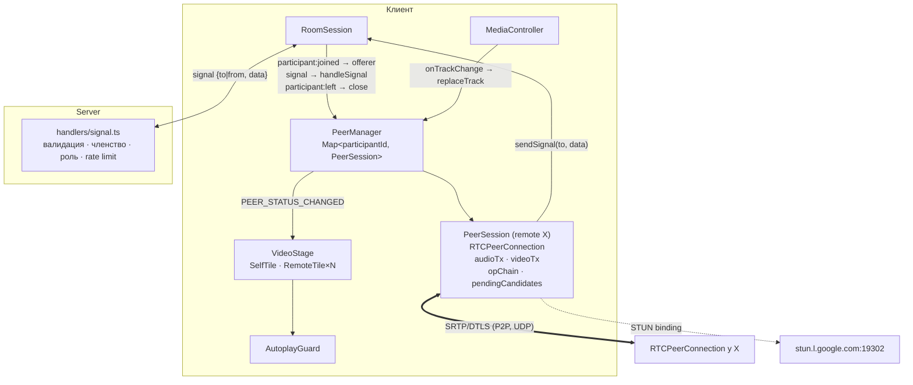
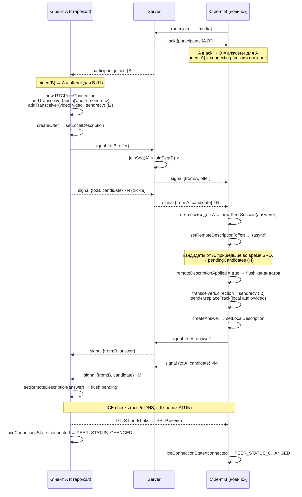
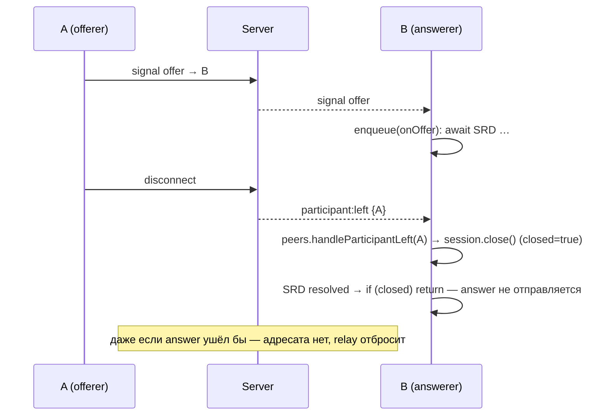

# TDD — WebRTC: P2P-звонок и сигналинг через Socket.io

| | |
|---|---|
| **Документ** | Technical Design Document (TDD) |
| **feature-name** | `webrtc-peer-call` |
| **Этап** | 4 из 5 |
| **Версия** | 1.0 (Draft) |
| **Дата** | 2026-09-13 |
| **PRD** | [`prd-video-chat-room.md`](../../prd-video-chat-room.md) v1.0 |
| **Зависит от** | [1 — room-skeleton](../room-skeleton/design-room-skeleton.md) (порядок ack → broadcast, callback-ack), [3 — local-media-controls](../local-media-controls/design-local-media-controls.md) (`MediaController`, `onTrackChange`, `VideoTile`) |
| **Следующий этап** | [5 — mesh-group-call](../mesh-group-call/design-mesh-group-call.md) |

> Документ описывает **только дельту**. Общие решения заданы в TDD этапа 1.

---

## 1. Overview / Контекст

### 1.1 Цель этапа

Поднять реальный аудио-видеозвонок между участниками комнаты:

- сигнальный relay (SDP offer/answer, ICE-кандидаты) через существующий Socket.io-сервер;
- `PeerSession` — одно `RTCPeerConnection` на пару участников, **без ренеготиации и без glare**;
- `PeerManager` — реестр сессий по `participantId`. **С первого дня это `Map`**, чтобы на этапе 5 обобщение на mesh не требовало переписывать ядро;
- включение и выключение камеры и микрофона без ренеготиации (`replaceTrack`), поверх контракта этапа 3;
- удалённая плитка: видео + звук, имя, заглушка, иконка микрофона, статус соединения;
- autoplay-политика (FR-37) и недоступность STUN (FR-34).

**Критерий готовности этапа:** два участника в комнате видят и слышат друг друга, переключения камеры и микрофона работают без новых offer, выход одного корректно закрывает соединение у другого. Технически код уже работает и для 3–4 участников, но раскладка сетки, гонки при N > 2 и нагрузка — предмет этапа 5.

### 1.2 Покрываемые требования PRD

| Группа | Требования |
|---|---|
| Видео и аудио | FR 10 (F-06), FR 11–12 (для пары: self-view + удалённая плитка, имя оверлеем) |
| Индикация у других | FR 16, 18 (на удалённой плитке) |
| Окружение | FR 34 (STUN недоступен), FR 37 (autoplay) |
| User Stories | US-6 (потоки, задержка), US-7 (у других), US-12 (как видят участника без видео), US-13 (autoplay) |

**Не входит:** TURN, ICE restart и автовосстановление медиа, ограничение битрейта, индикатор говорящего, демонстрация экрана (PRD, Non-Goals); адаптивная сетка 1–4 (этап 5).

### 1.3 Ограничения

- Топология — **mesh P2P**, ICE через **публичные Google STUN**, TURN нет. Недостижимость отдельной пары допустима (PRD §7).
- Автопереподключения нет. При `failed` пара остаётся «без медиа» до выхода одного из участников.
- Firefox 100–112 **не поддерживает** `RTCPeerConnection.connectionState`. Статус соединения берётся из `iceConnectionState`, который поддерживается всеми целевыми браузерами.

---

## 2. Current Architecture & Codebase Summary

Состояние **после этапов 1–3** (спроектированные файлы; кода в репозитории на момент написания нет).

| Путь | Класс / функция | Назначение | Изменение на этапе 4 |
|---|---|---|---|
| `packages/shared/src/protocol.ts` | `ParticipantDTO{id,name,joinedAt,media}`, `room:*`, `participant:*`, `chat:*`, `media:*` | Контракт | + `SignalData`, `IceCandidateDTO`, событие `signal` в обе стороны |
| `packages/server/src/rooms/types.ts` | `Participant{…, chatBucket, media}` | Модель | + `joinSeq`, `signalBucket` |
| `packages/server/src/rooms/RoomRegistry.ts` | `join` (атомарно), `leave`, `getParticipant`, `updateMedia` | Реестр | `join` проставляет монотонный `joinSeq` |
| `packages/server/src/socket/handlers/room.ts` | `room:join`: **сначала ack новичку, потом broadcast старожилам** | Вход | Без изменений. **На этом порядке строится правило offer** |
| `packages/client/src/session/RoomSession.ts` | callback-ack, слушатели до `connect()`, владеет `MediaController` | Side effects | + владеет `PeerManager`, маршрутизирует `participant:*` и `signal` |
| `packages/client/src/media/MediaController.ts` | `getTracks()`, `onTrackChange(listener)` — ждёт Promise подписчиков перед `track.stop()` | Локальные треки | Без изменений. `PeerManager` становится подписчиком |
| `packages/client/src/features/call/VideoTile.tsx` | Плитка: `<video>` всегда смонтирован, плейсхолдер, иконка mic | UI | Переиспользуется для удалённых |
| `packages/client/src/features/call/VideoStage.tsx` | Только `SelfTile` | UI | + `RemoteTile` для каждого удалённого участника |
| `packages/client/src/state/appReducer.ts` | `participants*`, `localMedia`, `notice` | State | + `peers`, `autoplayBlocked` |

---

## 3. Proposed Architecture / High-Level Design

### 3.1 Компоненты



Сервер **не участвует в медиа** и не хранит SDP. Он только пересылает сообщения адресату в той же комнате.

### 3.2 Инварианты этапа

Корректность звонка держится на четырёх инвариантах. Каждый закрывает конкретный класс «тихих» багов.

| # | Инвариант | Что предотвращает |
|---|---|---|
| **I1** | **Offer шлёт только тот, кто вошёл в комнату раньше** (по серверному порядку входа). Новичок только отвечает. На одно `RTCPeerConnection` приходится **ровно одна** пара offer/answer, `negotiationneeded` игнорируется | Glare: оба пира одновременно шлют offer, `setRemoteDescription` падает с `InvalidStateError`, соединение не поднимается |
| **I2** | **Фиксированная раскладка трансиверов**: `m=audio`, затем `m=video`, оба `sendrecv`. Создаются offerer'ом **при создании PC**, даже если трека нет. Answerer явно ставит `direction = 'sendrecv'` **до** `createAnswer` | Невозможность включить камеру позже без ренеготиации; answer с `recvonly`, после которого `replaceTrack` «ничего не передаёт» |
| **I3** | Треки меняются **только** через `RTCRtpSender.replaceTrack`. `addTrack`/`removeTrack` запрещены | Ренеготиация, а значит нарушение I1 |
| **I4** | ICE-кандидаты, пришедшие **до применения remote description**, буферизуются в очереди на пира и применяются после `setRemoteDescription`. SDP-операции и `replaceTrack` одного пира **сериализованы** | Молча не поднимающееся соединение: `addIceCandidate` до SRD бросает ошибку, а кандидаты теряются. Гонки async-операций с `close()` |

#### Почему I1 гарантирует отсутствие glare

Сервер однопоточен и обрабатывает `room:join` последовательно, поэтому **порядок входа — строгий полный порядок**. Для любой пары (X, Y), где X вошёл раньше:

- X узнаёт о Y из события `participant:joined(Y)` и становится **offerer'ом**;
- Y узнаёт о X из **списка `participants` в своём join-ack** и становится **answerer'ом**, ожидая offer.

Ни у одной пары обе стороны не получат `participant:joined` друг о друге. Порядок пакетов «ack → последующие события» гарантирован на этапе 1 (ack отправляется в том же синхронном блоке, что и `socket.join`, а клиент обрабатывает ack callback'ом, а не `await`). Поскольку ренеготиаций нет (I3), второго offer не бывает никогда.

Защита в глубину: **сервер отбрасывает `offer`** от участника с большим `joinSeq`, чем у адресата, и `answer` в обратном направлении (§4.2). Нарушение I1 на клиенте проявится как упавший тест, а не как glare в проде.

> Альтернатива — «perfect negotiation» (polite/impolite peer, rollback). Она нужна, когда ренеготиация неизбежна (screen share, добавление треков на лету). У нас этого нет (PRD, Non-Goals), поэтому более простое правило I1 + I3 достаточно и проще в тестировании.

#### Уточнение к `track.stop()`

Остановка трека, прикреплённого к отправителю, **не рвёт** `RTCPeerConnection`: отправитель просто перестаёт слать кадры. Ломается **повторное включение**: остановленный трек мёртв, и новый через `addTrack` потребует ренеготиации. Отсюда I2 + I3: трансивер существует всегда, трек в нём меняется `replaceTrack(null | track)`. Порядок «сначала `replaceTrack(null)` у всех пиров, потом `stop()`» обеспечивает `MediaController` (этап 3, §4.3).

---

## 4. Components & Interfaces

### 4.1 `@vcr/shared`

#### `protocol.ts` (+)

```ts
export interface IceCandidateDTO {
  candidate: string;
  sdpMid: string | null;
  sdpMLineIndex: number | null;
  usernameFragment?: string | null;
}

export type SignalData =
  | { type: 'offer'; sdp: string }
  | { type: 'answer'; sdp: string }
  | { type: 'candidate'; candidate: IceCandidateDTO };

export interface ClientToServerEvents {
  // … этапы 1–3
  signal: (msg: { to: string; data: SignalData }) => void;       // fire-and-forget
}

export interface ServerToClientEvents {
  // … этапы 1–3
  signal: (msg: { from: string; data: SignalData }) => void;
}
```

#### `constants.ts` (+)

```ts
export const SDP_MAX_LENGTH = 32_000;
export const ICE_CANDIDATE_MAX_LENGTH = 1_000;
export const SIGNAL_RATE_LIMIT = { burst: 100, refillPerSecond: 50 } as const;
export const PEER_CONNECT_TIMEOUT_MS = 20_000;
```

### 4.2 Сервер

#### `rooms/types.ts` / `RoomRegistry.ts` (+)

```ts
export interface Participant {
  // … этапы 1–3
  joinSeq: number;            // глобальный монотонный счётчик registry; порядок входа без коллизий по ms
  signalBucket: TokenBucket;
}
```

`joinSeq` проставляется в синхронном `RoomRegistry.join` (`this.seq++`). `joinedAt` остаётся для отображения, но для ролей не используется: два входа могут прийтись на одну миллисекунду.

#### `socket/schemas.ts` (+)

```ts
const IceCandidateSchema = z.object({
  candidate: z.string().max(ICE_CANDIDATE_MAX_LENGTH),
  sdpMid: z.string().max(32).nullable(),
  sdpMLineIndex: z.number().int().min(0).max(16).nullable(),
  usernameFragment: z.string().max(256).nullable().optional(),
}).strict();

export const SignalSchema = z.object({
  to: z.string().uuid(),
  data: z.discriminatedUnion('type', [
    z.object({ type: z.literal('offer'),  sdp: z.string().min(1).max(SDP_MAX_LENGTH) }).strict(),
    z.object({ type: z.literal('answer'), sdp: z.string().min(1).max(SDP_MAX_LENGTH) }).strict(),
    z.object({ type: z.literal('candidate'), candidate: IceCandidateSchema }).strict(),
  ]),
}).strict();
```

#### `socket/handlers/signal.ts`

```ts
socket.on('signal', (raw) => {
  const member = getMembership(ctx, socket);
  if (!member) return;
  const parsed = SignalSchema.safeParse(raw);
  if (!parsed.success) return ctx.logger.debug('signal.invalid', { roomId: member.roomId });
  const { to, data } = parsed.data;
  if (to === member.participant.id) return;

  const target = ctx.registry.getParticipant(member.roomId, to);
  if (!target) return;                                   // адресат вышел или в другой комнате

  // I1 — защита в глубину: offer только «старший → младший», answer — наоборот
  if (data.type === 'offer'  && member.participant.joinSeq > target.joinSeq) return drop('offer-role');
  if (data.type === 'answer' && member.participant.joinSeq < target.joinSeq) return drop('answer-role');

  if (!member.participant.signalBucket.tryTake()) return drop('rate-limited');

  ctx.io.to(target.socketId).emit('signal', { from: member.participant.id, data });
});
```

- Ack нет. Порядок сообщений от одного сокета к одному адресату Socket.io сохраняет (один сокет → один обработчик → один исходящий сокет), а на этом держится «offer раньше кандидатов».
- Отброшенные сообщения логируются на уровне `debug` с причиной, **без содержимого SDP**.

### 4.3 Клиент — `call/rtcConfig.ts`

```ts
export function getRtcConfiguration(): RTCConfiguration {
  return {
    iceServers: parseIceServers(import.meta.env.VITE_ICE_SERVERS)
      ?? [{ urls: ['stun:stun.l.google.com:19302', 'stun:stun1.l.google.com:19302'] }],
    iceTransportPolicy: import.meta.env.VITE_ICE_TRANSPORT_POLICY === 'relay' ? 'relay' : 'all', // relay — только для E2E «ICE failed»
    bundlePolicy: 'max-bundle',
    rtcpMuxPolicy: 'require',
  };
}
```

### 4.4 Клиент — `call/PeerSession.ts`

#### Интерфейс

```ts
export type PeerRole = 'offerer' | 'answerer';
export type PeerStatus = 'connecting' | 'connected' | 'unstable' | 'failed' | 'closed';

export interface PeerSessionDeps {
  remoteId: string;
  role: PeerRole;
  rtcConfig: RTCConfiguration;
  getLocalTracks: () => LocalTracks;                 // из MediaController (актуальные на момент вызова)
  sendSignal: (data: SignalData) => void;
  onStatus: (status: PeerStatus) => void;
  createPeerConnection?: (cfg: RTCConfiguration) => RTCPeerConnection; // DI для unit-тестов
  connectTimeoutMs?: number;
}

export class PeerSession {
  readonly remoteId: string;
  readonly role: PeerRole;
  readonly remoteStream: MediaStream;               // стабильный объект на всё время жизни сессии

  constructor(deps: PeerSessionDeps);
  start(): void;                                    // только offerer
  handleSignal(data: SignalData): void;
  replaceTrack(kind: TrackKind, track: MediaStreamTrack | null): Promise<void>;
  getStats(): Promise<RTCStatsReport>;              // диагностика / E2E
  close(): void;                                    // идемпотентно
}
```

#### Внутреннее состояние

```ts
private readonly pc: RTCPeerConnection;
private audioTx: RTCRtpTransceiver | null = null;
private videoTx: RTCRtpTransceiver | null = null;
private opChain: Promise<void> = Promise.resolve();   // I4: сериализация SDP-операций и replaceTrack
private remoteDescriptionApplied = false;             // I4: флаг для буфера кандидатов
private pendingCandidates: IceCandidateDTO[] = [];    // I4: очередь «кандидаты до SRD»
private closed = false;
private connectTimer: ReturnType<typeof setTimeout> | null = null;
```

```ts
private enqueue(op: () => Promise<void>): Promise<void> {
  const next = this.opChain.then(() => (this.closed ? undefined : op()));
  this.opChain = next.catch((e) => this.fail('op-error', e));   // ошибка не рвёт цепочку
  return next;
}
```

После **каждого** `await` внутри операции стоит проверка `if (this.closed) return;`. Участник мог выйти, пока шёл `setRemoteDescription`.

#### Offerer: `start()`

```ts
start() {
  this.enqueue(async () => {
    const { audio, video } = this.getLocalTracks();
    // I2: оба трансивера — всегда, в фиксированном порядке, sendrecv
    this.audioTx = this.pc.addTransceiver(audio ?? 'audio', { direction: 'sendrecv' });
    this.videoTx = this.pc.addTransceiver(video ?? 'video', { direction: 'sendrecv' });
    this.attachRemoteTracks();
    const offer = await this.pc.createOffer();
    if (this.closed) return;
    await this.pc.setLocalDescription(offer);
    if (this.closed) return;
    this.sendSignal({ type: 'offer', sdp: this.pc.localDescription!.sdp });
    this.armConnectTimeout();
  });
}
```

#### Answerer: обработка offer

```ts
private async onOffer(sdp: string) {
  if (this.role !== 'answerer' || this.pc.remoteDescription) return this.protocolViolation('unexpected-offer');
  await this.pc.setRemoteDescription({ type: 'offer', sdp });
  if (this.closed) return;
  this.remoteDescriptionApplied = true;
  await this.flushPendingCandidates();                 // I4
  if (this.closed) return;

  const txs = this.pc.getTransceivers();
  this.audioTx = txs.find(t => t.receiver.track.kind === 'audio') ?? null;
  this.videoTx = txs.find(t => t.receiver.track.kind === 'video') ?? null;
  if (!this.audioTx || !this.videoTx || txs.length !== 2) return this.protocolViolation('bad-m-lines');

  // I2: трансиверы, созданные из remote offer, по умолчанию 'recvonly' — ОБЯЗАТЕЛЬНО sendrecv до createAnswer
  this.audioTx.direction = 'sendrecv';
  this.videoTx.direction = 'sendrecv';
  const { audio, video } = this.getLocalTracks();      // читаем ПОСЛЕ SRD — актуальное состояние
  await this.audioTx.sender.replaceTrack(audio);
  await this.videoTx.sender.replaceTrack(video);
  this.attachRemoteTracks();

  const answer = await this.pc.createAnswer();
  if (this.closed) return;
  await this.pc.setLocalDescription(answer);
  if (this.closed) return;
  this.sendSignal({ type: 'answer', sdp: this.pc.localDescription!.sdp });
  this.armConnectTimeout();
}
```

#### Offerer: обработка answer

```ts
private async onAnswer(sdp: string) {
  if (this.role !== 'offerer' || this.pc.signalingState !== 'have-local-offer') return this.protocolViolation('unexpected-answer');
  await this.pc.setRemoteDescription({ type: 'answer', sdp });
  if (this.closed) return;
  this.remoteDescriptionApplied = true;
  await this.flushPendingCandidates();
}
```

#### ICE-кандидаты (I4)

```ts
handleSignal(data: SignalData) {
  switch (data.type) {
    case 'offer':  void this.enqueue(() => this.onOffer(data.sdp)); break;
    case 'answer': void this.enqueue(() => this.onAnswer(data.sdp)); break;
    case 'candidate':
      if (!this.remoteDescriptionApplied) this.pendingCandidates.push(data.candidate);  // буфер
      else void this.addCandidate(data.candidate);
      break;
  }
}

private async flushPendingCandidates() {
  const queue = this.pendingCandidates;
  this.pendingCandidates = [];
  for (const c of queue) await this.addCandidate(c);    // в исходном порядке
}

private async addCandidate(c: IceCandidateDTO) {
  try { await this.pc.addIceCandidate(c); }
  catch (e) { console.warn('[peer] addIceCandidate failed', this.remoteId, e); } // один плохой кандидат не валит сессию
}

// исходящие
this.pc.onicecandidate = (e) => { if (e.candidate) this.sendSignal({ type: 'candidate', candidate: e.candidate.toJSON() as IceCandidateDTO }); };
this.pc.onnegotiationneeded = null;                    // I1/I3: сознательно не обрабатываем
```

**Разделение ответственности:**
- **`pendingCandidates`** решает проблему «кандидат пришёл, а remote description ещё не применён». Флаг выставляется **после** `await setRemoteDescription`, а не проверкой `pc.remoteDescription`, потому что пока SRD в процессе, это поле ещё `null`.
- **`opChain`** сериализует SDP-шаги и `replaceTrack`, чтобы они не перемешивались между собой и с `close()`. Кандидаты в `opChain` **не** ставятся: иначе они ждали бы не относящиеся к ним операции.

#### `replaceTrack`

```ts
replaceTrack(kind: TrackKind, track: MediaStreamTrack | null): Promise<void> {
  return this.enqueue(async () => {
    const tx = kind === 'audio' ? this.audioTx : this.videoTx;
    if (!tx) return;          // answerer до offer: трек будет прочитан из getLocalTracks() при ответе
    await tx.sender.replaceTrack(track);
  });
}
```

Корректность при гонке «камеру выключили, пока answerer обрабатывает offer»: `MediaController` **сначала** обновляет `getTracks()`, **потом** вызывает подписчиков (этап 3). Если `onOffer` прочитал треки до смены, `replaceTrack(null)` встанет в `opChain` **после** `onOffer` и выполнится последним. Если после — `onOffer` сразу прочитает `null`. В обоих случаях итог — `null`.

#### Статус соединения

```ts
this.pc.oniceconnectionstatechange = () => {
  const s = this.pc.iceConnectionState;
  const status: PeerStatus =
      s === 'connected' || s === 'completed' ? 'connected'
    : s === 'disconnected'                   ? 'unstable'
    : s === 'failed'                         ? 'failed'
    : s === 'closed'                         ? 'closed'
    :                                          'connecting';          // new / checking
  if (status === 'connected') this.clearConnectTimeout();
  this.onStatus(status);
};
```

- `armConnectTimeout()`: если за `PEER_CONNECT_TIMEOUT_MS` не было `connected`, сессия получает `onStatus('failed')` (например, STUN недоступен и host-кандидаты не проходят). PC не закрывается: если ICE всё же соединится позже, статус обновится.
- `unstable` — переходное состояние (ICE может восстановиться сам). ICE restart не делаем (§14).

#### Удалённый поток

```ts
private attachRemoteTracks() {
  for (const tx of [this.audioTx, this.videoTx]) {
    const t = tx?.receiver.track;
    if (t && !this.remoteStream.getTracks().includes(t)) this.remoteStream.addTrack(t);
  }
}
```

`receiver.track` существует с момента создания трансивера и **не меняется** при `replaceTrack` на удалённой стороне. Поэтому `remoteStream` — стабильный объект на всё время жизни сессии, и `ontrack` не нужен.

#### `close()`

```ts
close() {
  if (this.closed) return;
  this.closed = true;
  this.clearConnectTimeout();
  this.pendingCandidates = [];
  this.pc.onicecandidate = this.pc.oniceconnectionstatechange = null;
  this.pc.close();                  // удалённые треки переходят в ended, локальные НЕ трогаем — ими владеет MediaController
  this.onStatus('closed');
}
```

### 4.5 Клиент — `call/PeerManager.ts`

```ts
export class PeerManager {
  constructor(deps: {
    media: MediaController;
    rtcConfig: RTCConfiguration;
    sendSignal: (to: string, data: SignalData) => void;
    onPeerStatus: (participantId: string, status: PeerStatus) => void;
    createSession?: (d: PeerSessionDeps) => PeerSession;   // DI для тестов
  });

  /** Вызывается на participant:joined — я вошёл раньше → offerer (I1). */
  handleParticipantJoined(participantId: string): void;

  /** Вызывается на signal. Offer от неизвестного → создать answerer. */
  handleSignal(from: string, data: SignalData): void;

  /** Вызывается на participant:left. */
  handleParticipantLeft(participantId: string): void;

  getRemoteStream(participantId: string): MediaStream | null;
  getStats(participantId: string): Promise<RTCStatsReport | null>;
  closeAll(): void;
}
```

Правила маршрутизации:

| Событие | Сессии нет | Сессия есть |
|---|---|---|
| `participant:joined(X)` | Создать `offerer` → `start()` | Ошибка протокола (дубль события), игнор + warn |
| `signal offer` от X | Создать `answerer` → `handleSignal` | Если сессия `offerer`, это нарушение I1 (warn, игнор). Если `answerer`, это повторный offer (warn, игнор) |
| `signal answer/candidate` от X | Игнор (сессия уже закрыта или сообщение опоздало) | `handleSignal` |
| `participant:left(X)` | Игнор | `close()` + удалить из `Map` |

Подписка на смену треков (контракт этапа 3):

```ts
this.unsubscribe = deps.media.onTrackChange((kind, track) =>
  Promise.all([...this.sessions.values()].map(s => s.replaceTrack(kind, track))).then(() => undefined));
```

`MediaController` дожидается этого Promise, прежде чем вызвать `track.stop()`.

### 4.6 Клиент — `RoomSession` (изменения)

```ts
// при создании сокета (до connect)
this.peers = new PeerManager({
  media: this.media,
  rtcConfig: getRtcConfiguration(),
  sendSignal: (to, data) => this.socket?.emit('signal', { to, data }),
  onPeerStatus: (id, status) => this.dispatch({ type: 'PEER_STATUS_CHANGED', participantId: id, status }),
});

socket.on('participant:joined', (e) => { this.dispatch({ type: 'PARTICIPANT_JOINED', … }); this.peers.handleParticipantJoined(e.participant.id); });
socket.on('participant:left',   (e) => { this.peers.handleParticipantLeft(e.participantId); this.dispatch({ type: 'PARTICIPANT_LEFT', … }); });
socket.on('signal',             (m) => this.peers.handleSignal(m.from, m.data));
```

- На `JOIN_SUCCEEDED` для каждого `participants[i] !== self` выполняется `dispatch(PEER_STATUS_CHANGED, 'connecting')`. Сессия answerer'а создаётся лениво, по offer.
- `leave()`, `JOIN_FAILED`, `CONNECTION_LOST` → `peers.closeAll()`, затем `media.stopAll()`.
- **Сигналы, пришедшие в фазе, отличной от `joined`**, игнорируются (защита от «хвостов» после выхода).

### 4.7 Клиент — state

```ts
export interface AppState {
  // … этапы 1–3
  peers: Record<string, { status: PeerStatus }>;
  autoplayBlocked: boolean;
}

export type AppAction =
  // … этапы 1–3
  | { type: 'PEER_STATUS_CHANGED'; participantId: string; status: PeerStatus }
  | { type: 'AUTOPLAY_BLOCKED' }
  | { type: 'AUTOPLAY_RESUMED' };
// PARTICIPANT_LEFT также удаляет peers[participantId]
```

`RTCPeerConnection` и `MediaStream` в state **не попадают** (принцип этапа 1). Плитка берёт поток через `session.peers.getRemoteStream(id)`: это стабильный объект, ре-рендер запускает изменение `peers[id].status`.

### 4.8 Клиент — UI

| Компонент | Ответственность |
|---|---|
| `features/call/RemoteTile.tsx` | `VideoTile` с `stream = peers.getRemoteStream(id)`, `muted={false}`, `mirrored={false}`, `showVideo = participant.media.video && status === 'connected' && hasFreshFrame`, `audioMuted = !participant.media.audio`, `statusLabel` по §8 |
| `features/call/VideoStage.tsx` | Этап 4: `SelfTile` + `RemoteTile` для каждого удалённого участника (flex-ряд). Сетка 1–4 — этап 5 |
| `features/call/useFreshFrame.ts` | **Should.** После перехода `media.video` в `true` ждёт новый кадр через `video.requestVideoFrameCallback` (если поддерживается) и только тогда показывает видео. Иначе на долю секунды виден «замёрзший» последний кадр до выключения. Fallback — показывать сразу |
| `features/call/AutoplayGuard.tsx` | Реестр `<video>` удалённых плиток (`Set<HTMLVideoElement>`). `register(el)` вызывает `el.play()`, при `NotAllowedError` выполняется `dispatch(AUTOPLAY_BLOCKED)`. Баннер «Браузер заблокировал воспроизведение звука» + кнопка **«Включить звук»** → `resumeAll()` в обработчике клика → `AUTOPLAY_RESUMED` |

> **Autoplay на практике.** Вход инициируется кликом («Войти» или «Создать комнату»), и у страницы есть активная медиасессия (захвачены камера или микрофон). В Chrome, Edge и Firefox этого обычно достаточно для воспроизведения со звуком. Баннер — страховка для случаев без захвата медиа (`denied`/`not-found`) и для строгих политик. Удалённая плитка не монтирует `<video>` заново при изменении статуса, иначе autoplay-разрешение пришлось бы получать снова.

---

## 5. Data Model & DB Changes

БД нет. Изменения in-memory модели на сервере:

```ts
Participant {
  id, socketId, name, joinedAt, chatBucket, media,   // этапы 1–3
  joinSeq: number,          // + монотонный порядок входа (роль offer/answer)
  signalBucket: TokenBucket // + антифлуд сигналинга
}
```

Сервер **не хранит** SDP и ICE-кандидаты: relay без состояния.

Клиентский ресурсный слой (не state): `PeerManager.sessions: Map<participantId, PeerSession>`. Каждая `PeerSession` держит `RTCPeerConnection`, 2 трансивера, `remoteStream`, `pendingCandidates`.

Миграций нет.

---

## 6. API / Contracts

### 6.1 `signal` (C→S)

```json
{ "to": "1d2e…9a", "data": { "type": "offer", "sdp": "v=0\r\no=- 4611… 2 IN IP4 127.0.0.1\r\n…m=audio 9 UDP/TLS/RTP/SAVPF 111 …\r\na=sendrecv\r\n…m=video 9 UDP/TLS/RTP/SAVPF 96 …\r\na=sendrecv\r\n" } }
```

```json
{ "to": "8b0f…c1", "data": { "type": "answer", "sdp": "v=0\r\n…" } }
```

```json
{
  "to": "1d2e…9a",
  "data": {
    "type": "candidate",
    "candidate": {
      "candidate": "candidate:842163049 1 udp 1677729535 3f1a…e2.local 54400 typ host generation 0",
      "sdpMid": "0",
      "sdpMLineIndex": 0,
      "usernameFragment": "Vh3x"
    }
  }
}
```

### 6.2 `signal` (S→C)

Та же структура, `to` заменено на `from` (id отправителя, проставленный сервером):

```json
{ "from": "8b0f…c1", "data": { "type": "offer", "sdp": "v=0\r\n…" } }
```

### 6.3 Правила relay (сервер)

| Проверка | При нарушении |
|---|---|
| Отправитель в комнате | Тихо отбросить |
| Payload по `SignalSchema` (размеры, strict) | Отбросить, `debug`-лог |
| `to !== from` | Отбросить |
| Адресат в **той же** комнате | Отбросить (адресат вышел — нормальная гонка) |
| `offer`: `from.joinSeq < to.joinSeq`; `answer`: `from.joinSeq > to.joinSeq` | Отбросить, `warn`-лог `signal.role-violation` |
| Rate limit (100 burst, 50/с) | Отбросить, `warn` |

Ack и коды ошибок не используются: сигналинг — fire-and-forget. Клиент узнаёт о проблеме по `PEER_CONNECT_TIMEOUT_MS` → `failed`.

---

## 7. Data & Control Flows

### 7.1 Установление соединения (A в комнате, входит B)



### 7.2 Выключение и включение камеры у A (без ренеготиации)

```mermaid
sequenceDiagram
  participant MC as MediaController (A)
  participant PM as PeerManager (A)
  participant PS as PeerSession A↔B
  participant IO as Server
  participant B as Клиент B

  MC->>MC: tracks.video = null
  MC->>PM: onTrackChange('video', null)
  PM->>PS: replaceTrack('video', null)  [opChain]
  PS-->>PM: resolved
  PM-->>MC: resolved
  MC->>MC: track.stop()  💡 лампочка гаснет
  MC->>IO: media:update {video:false}
  IO-->>B: participant:media → RemoteTile: заглушка
  Note over PS,B: кадры не приходят; SDP не менялся, offer не отправлялся

  MC->>MC: getUserMedia({video}) → T2; tracks.video = T2
  MC->>PM: onTrackChange('video', T2)
  PM->>PS: replaceTrack('video', T2)
  MC->>IO: media:update {video:true}
  IO-->>B: participant:media → ждать свежий кадр → показать видео
```

### 7.3 Выход участника во время согласования



---

## 8. Error Handling & Edge Cases

### 8.1 Статусы удалённой плитки

| `peers[id].status` | Подпись на плитке | Видео | Звук |
|---|---|---|---|
| `connecting` | «Подключение…» | Заглушка | — |
| `connected` | — (или «Камера выключена» при `media.video=false`) | По `media.video` | По `media.audio` + иконка |
| `unstable` | «Связь нестабильна…» | Последнее состояние | Как есть |
| `failed` | «Не удалось установить медиасоединение» | Заглушка | — |

Участник с `failed` **остаётся** в списке и в чате (FR-34: приложение не переходит в нерабочее состояние).

### 8.2 Сценарии

| Ситуация | Обнаружение | Поведение |
|---|---|---|
| STUN недоступен (FR-34) | Нет srflx-кандидатов | В LAN соединение поднимается по host/mDNS-кандидатам. Иначе через 20 с `failed` на плитке этой пары. Остальное приложение работает |
| Строгий NAT, пара недостижима | `iceConnectionState=failed` | `failed` на плитке у обеих сторон. Без TURN это допустимо (PRD §7) |
| mDNS-кандидаты не резолвятся (корпоративная сеть) | `failed` в LAN | Как выше + пункт в §13 |
| Кандидаты пришли до SRD | `remoteDescriptionApplied=false` | Буфер → flush после SRD (I4) |
| Неудачный `addIceCandidate` (битый кандидат) | Исключение | `warn`, остальные кандидаты применяются |
| Offer от участника, для которого я offerer (нарушение I1) | `PeerManager` видит сессию-`offerer` | Игнор + `warn` (сервер такой offer тоже отбрасывает) |
| Повторный offer (дубль) | `pc.remoteDescription` уже задан | Игнор + `warn` |
| Answer без ожидающего offer | `signalingState !== 'have-local-offer'` | Игнор + `warn` |
| В offer не 2 m-line или нет audio/video | Проверка после SRD | `failed`, `warn` (признак несовместимого клиента) |
| `participant:left` во время SRD или `createAnswer` | `closed=true` | Операции прекращаются, сигналы не шлются |
| Сигнал после выхода из комнаты | Фаза ≠ `joined` | Игнор |
| Autoplay заблокирован (FR-37) | `play()` → `NotAllowedError` | Баннер «Включить звук» → `resumeAll()` в обработчике клика |
| Камера выключена у обоих | — | Соединение живо (аудио), заглушки с именами |
| Участник вошёл без камеры, позже включил | Видео-трансивер существует (I2) | `replaceTrack(T)`, собеседник видит видео **без** нового offer |
| Остановка медиа-трека устройством (`ended`) | `MediaController` | `replaceTrack(null)` → `media:update` (этап 3) |
| Исключение внутри `opChain` | `catch` в `enqueue` | `failed` для этой пары, цепочка не «залипает» |
| `RTCPeerConnection` конструктор бросил (редкие политики браузера) | `try/catch` в `PeerManager` | `failed` для пары + notice |

---

## 9. Performance & Scalability

| Метрика | Цель | Обеспечение / как измерять |
|---|---|---|
| Время «вошёл → видео собеседника» в LAN | < 2 с p95 | Trickle ICE (кандидаты шлются сразу), `max-bundle` (один транспорт на пару) |
| Задержка медиа в LAN (US-6) | ≤ 500 мс | P2P без медиасервера. Метод измерения — в TDD этапа 5 |
| Ренеготиации | **0** за жизнь пары | I1–I3; E2E-счётчик offer (§11) |
| Сигнальный трафик на пару | 2 SDP (~5–10 KB) + десятки кандидатов | Rate limit на сервере |
| CPU при 2 участниках | 1 encode + 1 decode видео на клиента | 640×360@24 (этап 3). Нагрузка при 4 участниках — этап 5 |

Серверная нагрузка от сигналинга пренебрежимо мала: только relay, без хранения.

---

## 10. Security & Compliance

| Аспект | Мера |
|---|---|
| Шифрование медиа | DTLS-SRTP, штатно и обязательно в WebRTC. Отпечаток DTLS передаётся в SDP через наш сигнальный канал (WSS) |
| Целостность сигналинга | WSS (HTTPS в LAN/prod). `from` проставляет сервер, подделать отправителя нельзя |
| Изоляция комнат | Relay только адресату из той же комнаты. `to` на себя и в чужие комнаты отбрасывается |
| Злоупотребление relay | zod-схемы с лимитами размеров, rate limit, проверка ролей offer/answer |
| Раскрытие IP | Host-кандидаты скрываются браузером за mDNS (`*.local`). **srflx-кандидаты раскрывают публичный IP участника другим участникам комнаты** — это свойство P2P без TURN, принятое PRD. Указать в разделе «о приложении» или политике (TBD) |
| Логи | SDP и кандидаты **не логируются** (содержат IP и fingerprint). Только тип сигнала, `roomId` и причина отбрасывания |
| Отладочный доступ | `window.__vcr.peers` только в E2E-сборке (`VITE_E2E=1`), как на этапе 3 |

---

## 11. Testing Strategy

### 11.1 Unit — `PeerSession` (фейковый `RTCPeerConnection`)

`FakePeerConnection` записывает вызовы в журнал и отдаёт **управляемые Promise** (`deferred`) для `setRemoteDescription`, `createOffer`/`createAnswer`, `setLocalDescription`, `replaceTrack`, `addIceCandidate`. Трансиверы — фейки с `direction`, `sender.replaceTrack`, `receiver.track.kind`.

| Кейс | Ожидание |
|---|---|
| Offerer, камеры нет | `addTransceiver('audio'/'video' или трек, { direction: 'sendrecv' })` ровно 2 раза, audio первым; затем `createOffer` → SLD → `sendSignal(offer)` |
| Answerer | Журнал: `SRD` → `direction='sendrecv'` для обоих → `replaceTrack(audio)` → `replaceTrack(video)` → `createAnswer` → SLD → `sendSignal(answer)`. **`direction` выставлен до `createAnswer`** |
| **Кандидаты до SRD** | SRD в pending; 3 кандидата → `addIceCandidate` не вызван; resolve SRD → 3 вызова в исходном порядке |
| Кандидат после SRD | `addIceCandidate` сразу |
| Offerer: кандидаты от answerer до answer | Буфер → flush после `SRD(answer)` |
| Плохой кандидат | Reject одного → остальные применены, статус не `failed` |
| **`close()` во время SRD** | Resolve SRD после close → нет `createAnswer`, нет `sendSignal` |
| `negotiationneeded` | Диспатч события → нет `createOffer` |
| Повторный offer / answer не вовремя | Игнор + warn, состояние не меняется |
| `replaceTrack` сериализован | `replaceTrack(T1)`, `replaceTrack(null)` подряд → итоговый трек `null` |
| Гонка «камеру выключили во время onOffer» | `getLocalTracks` возвращает T, затем `replaceTrack(null)` в очереди → итог `null` |
| Маппинг `iceConnectionState` | `checking` → connecting, `completed` → connected, `disconnected` → unstable, `failed` → failed |
| Таймаут соединения | Фейковые таймеры: 20 с без `connected` → `failed`; позже `connected` → `connected` |

### 11.2 Unit — `PeerManager`

| Кейс | Ожидание |
|---|---|
| `handleParticipantJoined(X)` | Создана сессия `offerer`, вызван `start()` |
| Offer от неизвестного Y | Создана `answerer`, сигнал передан |
| Offer от X, для которого есть `offerer` | Игнор, warn |
| Answer / candidate от неизвестного | Игнор |
| `handleParticipantLeft(X)` | `close()`, удалена из `Map`, `getRemoteStream(X) === null` |
| `onTrackChange` | Все сессии получили `replaceTrack`; Promise подписчика резолвится только после всех |
| `closeAll` | Все закрыты, подписка на media снята |

### 11.3 Integration — сервер (`signal` relay)

| Тест | Ожидание |
|---|---|
| A → B offer | Получает только B, `from = A.id` |
| `to` = себе, чужой комнате, несуществующему | Никто не получает |
| Offer от младшего к старшему | Отброшен (роль) |
| Answer от старшего к младшему | Отброшен |
| SDP > 32 KB, лишние поля | Отброшены, сокет жив |
| Порядок | 200 кандидатов подряд A → B приходят в том же порядке |
| Rate limit | 500 сигналов синхронно → доставлено ≤ burst + refill |
| Отправитель не в комнате | Отброшено |

### 11.4 E2E (Playwright, `e2e/tests/webrtc-call.spec.ts`)

Chromium: `--use-fake-ui-for-media-stream`, `--use-fake-device-for-media-stream`, `--disable-features=WebRtcHideLocalIpsWithMdns` (стабильность loopback между контекстами). Хук `window.__vcr` (сборка `VITE_E2E=1`): `peers.ids()`, `peers.getStats(id)`, `debug.signalCounts` (счётчик отправленных offer/answer/candidate по пирам).

| Сценарий | Проверка |
|---|---|
| **Звонок двух участников** | У обоих удалённое `<video>`: `videoWidth > 0`, `currentTime` растёт; `inbound-rtp` (audio и video) `bytesReceived` растёт за 2 с |
| **Нет glare / ренеготиации** | После 5 циклов камера off/on и mic off/on: `signalCounts[peer].offer === 1` у старожила, `0` у новичка |
| **Камера off у A** | У B плейсхолдер ≤ 1 с; `framesDecoded` у B перестаёт расти; у A все видеотреки `ended` |
| **Вошёл без камеры → включил** | A: `addInitScript` делает первый `getUserMedia({video})` reject `NotFoundError`, следующие ok. После входа A жмёт «Камера» → у B `framesDecoded` растёт; новых offer нет |
| Микрофон off у A | У B иконка перечёркнутого микрофона; `inbound-rtp audio` `totalAudioEnergy` у B перестаёт расти (Should) |
| Выход A | У B плитка A исчезает, `peers.ids()` пуст |
| Закрытие вкладки A | То же, в пределах ≤ 2 с |
| Autoplay | `addInitScript`: первый `HTMLMediaElement.prototype.play` reject `NotAllowedError` → баннер → клик «Включить звук» → баннер скрыт, `video.paused === false` |
| STUN недоступен | Сборка с `VITE_ICE_SERVERS='[{"urls":"stun:127.0.0.1:9"}]'` → соединение всё равно `connected` (host-кандидаты) |
| ICE failed | `VITE_ICE_TRANSPORT_POLICY=relay` без TURN → через 20 с (в тесте конфиг таймаута 3 с) плитка «Не удалось установить медиасоединение»; чат работает |

### 11.5 Ручной чек-лист

- [ ] Два **разных** компьютера в одной Wi-Fi-сети по `https://<LAN-IP>:5173`: видео и звук в обе стороны.
- [ ] Chrome ↔ Firefox, Chrome ↔ Edge, Firefox ↔ Edge: совместимость SDP и трансиверов.
- [ ] `chrome://webrtc-internals` / `about:webrtc`: одна пара offer/answer на соединение, `iceConnectionState` = connected, выбранная пара кандидатов host (LAN).
- [ ] Выключить камеру → лампочка гаснет, у собеседника заглушка; включить → видео без «замёрзшего» кадра (при реализованном `useFreshFrame`).
- [ ] Отключить Wi-Fi у одного участника → у другого «Связь нестабильна…», через ≤ 15 с плитка исчезает (сервер: ping timeout).

### 11.6 Покрытие

`PeerSession` ≥ 90% строк (все ветки I1–I4), `PeerManager` ≥ 90%, `handlers/signal.ts` ≥ 95%.

---

## 12. Deployment & Migration Plan

- **HTTPS обязателен** для проверки между устройствами (режимы из этапа 1 без изменений).
- Новые переменные окружения клиента (на этапе сборки Vite):

  | Переменная | Default | Назначение |
  |---|---|---|
  | `VITE_ICE_SERVERS` | Google STUN ×2 | JSON-массив `RTCIceServer` |
  | `VITE_ICE_TRANSPORT_POLICY` | `all` | `relay` — только для E2E-сценария «ICE failed» |
  | `VITE_E2E` | не задан | Включает `window.__vcr` |

- CI: E2E-проект Chromium получает флаги fake-медиа и mDNS. На раннере важен UDP loopback (у GitHub Actions ubuntu-latest он есть).
- Feature flag не нужен: этап мёржится целиком. Rollback — `git revert` PR (вернётся поведение этапа 3: без передачи медиа).
- Защита инвариантов в линтере: `no-restricted-syntax` запрещает вызовы `.addTrack(`, `.removeTrack(` и `emitWithAck(` за пределами разрешённых файлов (I3, callback-ack).

---

## 13. Risks & Mitigations

| Риск | Вероятность / влияние | Митигация |
|---|---|---|
| Ренеготиация «просочится» (кто-то добавит `addTrack` или обработчик `negotiationneeded`) → glare | Средняя / высокое | I3 + ESLint-запрет, серверная проверка ролей, E2E «offer ровно 1» |
| Answerer забудет `direction='sendrecv'` → односторонний звонок | Средняя / высокое | Unit-тест порядка вызовов, E2E проверяет оба направления |
| mDNS-кандидаты не резолвятся в корпоративной или гостевой Wi-Fi (client isolation) | Средняя / высокое для LAN-демо | Проверка srflx через STUN; диагностика через `webrtc-internals`. Для демо — сеть без client isolation. TURN вне скоупа (§14) |
| Различия Chrome и Firefox (порядок m-line, `iceConnectionState`) | Средняя / среднее | Поиск трансиверов по `receiver.track.kind`, а не по индексу; ручная кросс-браузерная проверка; Firefox E2E-проект (Should) |
| Autoplay блокирует звук в отдельных браузерах | Низкая / среднее | Вход по клику + `AutoplayGuard` с кнопкой |
| «Замёрзший» последний кадр при включении камеры у собеседника | Высокая / низкое | `useFreshFrame` (rVFC). Без него это косметический дефект |
| Долгое «висение» пары в `unstable` без ICE restart | Средняя / низкое | Сервер удалит выбывшего по ping timeout (≤ 15 с). ICE restart — §14 |
| Утечка `RTCPeerConnection` при выходе (браузер ограничивает их число) | Низкая / среднее | `closeAll()` на всех путях выхода; E2E проверяет `peers.ids()` пуст; `webrtc-internals` в чек-листе |

---

## 14. Open Questions / TBD

1. **TBD:** Нужен ли ICE restart при `failed`/`unstable` (без переподключения к комнате)? PRD запрещает автопереподключение участника, но не медиа. Для ICE restart нужна ренеготиация (новый offer от того же offerer'а), и её придётся аккуратно встроить в I1. Предложение — не делать в v1.
2. **TBD:** Показывать ли пользователю детальный статус пары («Связь нестабильна…», «Не удалось установить медиасоединение») или только заглушку? Предложено показывать.
3. **TBD:** Нужен ли собственный STUN или TURN для демо вне LAN? PRD — нет. `VITE_ICE_SERVERS` позволяет добавить позже без изменений кода.
4. **TBD:** Упоминать ли в UI или документации, что участники P2P-звонка видят публичные IP друг друга?
5. **TBD:** Реализовывать ли `useFreshFrame` (Should) в этом этапе или отложить на этап 5?
6. **Решено по умолчанию:** статус соединения берётся из `iceConnectionState` (совместимость с Firefox 100–112), а не из `connectionState`.
